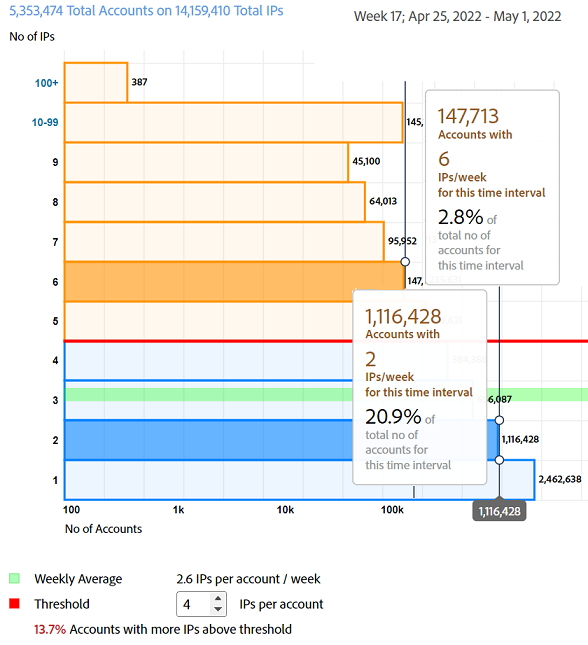
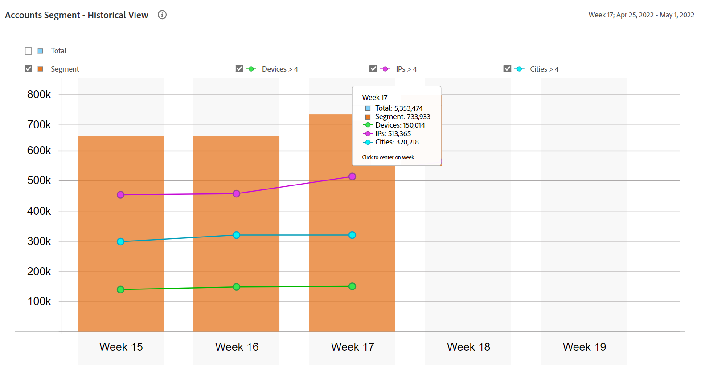

# [!UICONTROL General usage] relatórios {#general-usage-reports}

Os relatórios do [!UICONTROL Account IQ] são ferramentas básicas de análise que permitem analisar seus dados para isolar [coortes](/help/accountiq/product-concepts.md#segmet-def), identificar anomalias e criar uma compreensão das características da sua conta.

A página de relatórios do [!UICONTROL General usage] fornece ferramentas para separar métricas de subgrupo com base no número de dispositivos de conta em uso, IPs detectados e seus respectivos códigos postais.

Todos os relatórios se baseiam no segmento atual selecionado no painel [Segmentos e intervalo de tempo](/help/accountiq/segments-timeinterval.md). Você pode ajustar sua seleção e restringi-la ainda mais especificando limites (número de dispositivos, número de IPs e número de códigos postais) no painel [Visão geral do instantâneo - Contas acima dos limites](#snapshot-overview).

## Solicitações de reprodução e assinantes únicos {#playreq-uniquesubs}

Os gráficos de linha aqui fornecem uma visualização das alterações ao longo do tempo de valores, como Solicitações de reprodução e Assinantes únicos em um intervalo de tempo selecionado para o segmento definido.

+++ Serviços D2C: Solicitações Play/Assinantes únicos

*Solicitações de Reprodução/Assinantes Exclusivos para serviços D2C*

+++

+++Programadores: Solicitações De Reprodução/Assinantes Únicos

*Solicitações de Reprodução/Assinantes Exclusivos para programadores*

+++

+++MVPDs: Assinantes únicos

*Assinantes exclusivos para MVPDs*

+++

 

O eixo x representa o tempo com base no intervalo atual e o eixo y representa as métricas básicas de atividade do assinante durante esse período. Os gráficos de linha ajudam a visualizar e comparar a atividade dos assinantes no segmento atual. Dependendo da versão do Account IQ, as métricas incluem:

* **AuthN OK**: número de autenticações bem-sucedidas. Leia mais sobre [AuthN OK](/help/accountiq/product-concepts.md#authn-ok-def).

* **AuthZ OK**: Número de autorizações bem-sucedidas. Leia mais sobre [AuthZ OK](/help/accountiq/product-concepts.md#authz-ok-def).

* **Solicitações de reprodução**: Número de solicitações de reprodução. Leia mais sobre [Solicitações de reprodução](/help/accountiq/product-concepts.md#play-requests-def).

* **Assinantes Exclusivos**: Número de assinantes exclusivos bem-sucedidos. Leia mais sobre [Assinantes únicos](/help/accountiq/product-concepts.md#unique-subscriber-def).

>[!NOTE]
>
>A disponibilidade das métricas varia dependendo da versão do Account IQ.

## Visão geral do instantâneo - contas acima dos limites {#snapshot-overview}

Ajuste a análise e os relatórios usando esse filtro adicional para definir vários limites de uso. Depois de selecionar um segmento, você também pode usar os seguintes filtros para analisar mais o comportamento do assinante:

* Limite de número de dispositivos

* Limite de número de IPs

* Limite do número de códigos postais

Ao atualizar os valores de limite no painel [Contas baseadas em limites selecionados](#account-segments-basedon-segments), você verá o efeito em:

* [Dispositivos por semana (ou mês) por conta](#devices-week-account)

* [Locais por semana (ou mês) por conta](#locations-week-account)

* [IPs por semana (ou mês) por conta](#ip-week-account)

* [Visualização histórica do segmento de contas](#account-segment-historical-view)

>[!NOTE]
>
>Cada limite é definido com um valor padrão de 4. Ou seja, a página Uso Geral mostra análises para assinantes que usam mais de quatro dispositivos, consomem conteúdo de mais de quatro endereços IP diferentes, *e* mais de quatro códigos postais diferentes.

### Contas baseadas em segmentos nos limites selecionados {#account-segments-basedon-segments}

O painel **Segmento de contas com base nos limites selecionados** oferece opções para definir limites (entre 1 e 10) para o número de dispositivos, o número de IPs e o número de códigos postais.

O gráfico mostra:

* Número absoluto de contas de assinantes.

* Porcentagem do total de contas de assinantes no segmento que estão usando o número de dispositivos, a partir do número de IPs, no número de CEPs, conforme especificado pelos limites.

## Dispositivos por semana (ou mês) por conta {#devices-week-account}

Este gráfico de barras fornece insights sobre o comportamento de uso em termos de como os assinantes estão usando seus dispositivos para acessar conteúdo.

O eixo x representa o Número de contas e o eixo y representa o Número de dispositivos. Com base no limite definido para o número de dispositivos por conta, ele marca o número absoluto de contas de assinantes que consomem conteúdo de um número específico de dispositivos durante uma semana.

Ao passar o cursor do mouse sobre uma barra (específica do número de dispositivos), um rótulo é exibido fornecendo informações sobre o número de contas de assinantes (e a porcentagem do total de contas de assinantes no segmento) que estão transmitindo conteúdo do canal usando esses vários dispositivos em uma semana.

O gráfico também marca o seguinte:

* Uma linha vermelha para marcar o limite definido.

* Uma linha verde para marcar a média do número de dispositivos diferentes usados por uma conta de assinante por semana (ou mês).

A rosca fornece uma visualização alternativa dos dispositivos em uso pelas contas no segmento atual acima do limite definido.

## Locais por semana (ou mês) por conta {#locations-week-account}

Semelhante à métrica para [Dispositivos por semana (ou mês) por conta](#devices-week-account), a métrica Locais por semana (ou mês) por conta permite analisar o uso da conta do assinante em diferentes locais. O eixo x representa o Número de contas e o eixo y representa o Número de locais.

Depois de definir o limite para o número de locais, você pode usar o gráfico para identificar o seguinte:

* Número (e porcentagem) de assinantes que estão consumindo conteúdo de (um específico) x número de locais em uma semana.

* Porcentagem do total de contas de assinantes que estão exibindo conteúdo de mais locais do que o limite.

* Comparar a média semanal (número de locais diferentes para uma conta) com o limite.

## Ips por semana (ou mês) por conta {#ip-week-account}

Semelhante à métrica para **Número de Locais por semana por conta**, a métrica **Número de IPs por semana por conta** permite avaliar a quantidade de alterações na origem da transmissão para o segmento atual.

O eixo x representa o Número de contas e o eixo y representa o Número de IPs.

Depois de definir um segmento e o limite para o número de IPs, você pode usar o gráfico para identificar o seguinte:

* Número (e porcentagem) de assinantes que estão consumindo conteúdo de um número específico de IP em uma semana.

* Porcentagem do total de contas de assinantes que estão exibindo conteúdo de mais endereços IP do que o limite.

* Compare a média semanal (número de IPs diferentes para uma conta) com o limite.

## Exibição do histórico de segmentos das contas {#account-segment-historical-view}

O gráfico de barras Exibição histórica ajuda a comparar as métricas de uso em diferentes intervalos de tempo. Além disso, representa coletivamente as várias métricas de uso, como [Dispositivos por semana (ou mês) por conta](#devices-week-account), [Locais por semana (ou mês) por conta](#locations-week-account) e [IPs por semana (ou mês) por conta](#ip-week-account).

* O eixo x representa o intervalo de tempo e o eixo y representa o número de contas de assinantes, dispositivos, locais e IPs.

* As barras coloridas laranja significam segmentos em vários intervalos de tempo.

* O gráfico de linhas plota as alterações em [Dispositivos por semana (ou mês) por conta](#devices-week-account), [Locais por semana (ou mês) por conta](#locations-week-account) e [IPs por semana (ou mês) por conta](#ip-week-account) valores ao longo do intervalo de tempo com base no limite.

* As barras azuis significam o número total de assinantes ativos no setor por um intervalo de tempo.

* É possível selecionar legendas específicas para ajudá-lo a dimensionar o gráfico.

