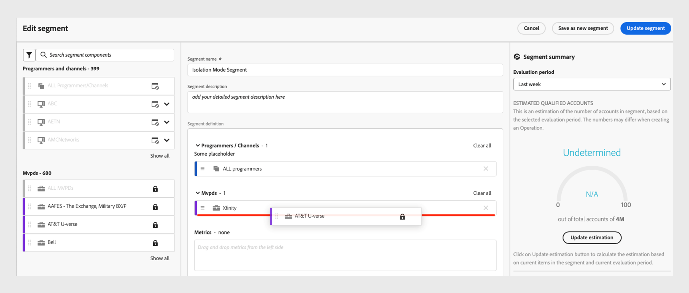

# MVPDs de modo de isolamento para programadores do TV Everywhere {#isolation-mode-tve}

>[!IMPORTANT]
>
> A limitação de MVPDs do Modo de Isolamento só é aplicável a programadores do TV Everywhere.

No Modo de isolamento, os MVPDs (como Xfinity) identificam de forma consistente os assinantes nos dispositivos com base em suas interações com programadores específicos. No modo padrão, os MVPDs identificam consistentemente os assinantes em todos os dispositivos, independentemente dos programadores envolvidos.

Veja um exemplo:

*MVPDs de Modo de Isolamento identifica quatro assinantes diferentes em vez de dois*

* Se um Assinante B de um MVPD de Modo de Isolamento (como Xfinity) acessar o conteúdo oferecido por dois programadores diferentes usando o mesmo dispositivo, o MVPD associará identificadores diferentes às duas tentativas de acesso diferentes. Parece que há dois assinantes diferentes acessando o conteúdo para os programadores (L e M na figura).

* Para MVPDs Padrão, se o Assinante B acessar o conteúdo oferecido por dois programadores diferentes, o MVPD associará um único identificador de acesso para ambas as tentativas de acesso.

* Os MVPDs (como Xfinity) no Modo de isolamento não identificam um assinante de maneira consistente, mesmo que o assinante use o mesmo dispositivo em diferentes programadores.

Para evitar a distorção de dados causada pela contagem de um único assinante como vários assinantes devido ao acesso de programadores diferentes, o Modo de isolamento restringe a atividade relatada sobre um programador somente a seus aplicativos.

Por exemplo, o Programador L pode exibir dados com base apenas na atividade das Identidades W e Y, ignorando as Identidades X e Z na imagem anterior.

>[!IMPORTANT]
>
> A desvantagem é que o Programador L é privado de compartilhar informações coletadas sobre os Assinantes A e B devido à atividade com qualquer Programador diferente de L.

No Modo de isolamento, as pontuações de compartilhamento e as métricas associadas são calculadas somente a partir da atividade dos dispositivos que transmitem a partir dos aplicativos do programador e do canal selecionados. As pontuações e probabilidades de compartilhamento são calculadas a partir dos inícios de fluxo nos canais selecionados no momento.

O sistema opera automaticamente no Modo de isolamento quando o segmento selecionado contém um MVPD de modo de isolamento que identifica assinantes únicos como vários assinantes ao transmitir de programadores diferentes. Todos os gráficos e tabelas desses segmentos refletirão os resultados desse comportamento alterado.

>[!IMPORTANT]
>
> O comportamento no Modo de Isolamento é incompatível com o modo padrão, o Modo de Isolamento MVPD não pode ser misturado com outros MVPDs e vice-versa.

Para criar um segmento que seja analisado no Modo de Isolamento, arraste o MVPD do Modo de Isolamento, como **Xfinity**, para a seção MVPDs da definição de segmento.

>[!NOTE]
>
> Como os MVPDs do modo de isolamento não podem ser misturados com outros MVPDs, a seção MVPD da definição de segmento não permitirá que outro MVPD seja arrastado até lá.

*Seleção de Xfinity no Modo de Isolamento*

>[!IMPORTANT]
>
> O compartilhamento de conta é mais relevante quando medido para transmissão em todos os aplicativos do programador. Espere **Pontuações de Compartilhamento** mais baixas e alguma variação nas métricas no Modo de Isolamento.

*Medidores de probabilidade de compartilhamento no Modo de Isolamento*

Os medidores acima mostram que apenas 9% de todas as contas são compartilhadas e, entre elas, apenas 11% do conteúdo é consumido. Devido às pontuações naturalmente mais baixas, os resultados no Modo de isolamento devem ser interpretados de forma diferente dos resultados no modo padrão.
