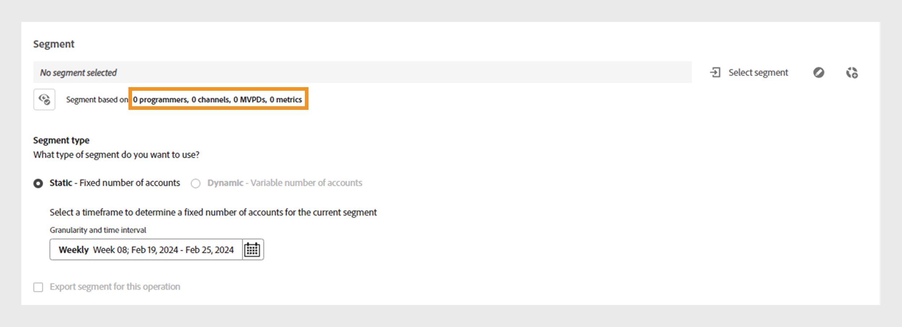

# Operações {#operations-tab-next-steps}

Depois de analisar os padrões de uso do assinante e identificar as instâncias de compartilhamento de senha para um segmento selecionado usando [!DNL Account IQ] Analytics, você pode realizar ações direcionadas por meio de procedimentos focados chamados [!DNL Account IQ].

**Operações** O permite rastrear e gerenciar com eficiência o compartilhamento de credenciais em um grupo de contas, para reduzir o compartilhamento de senhas e aprimorar a experiência de assinantes importantes.

É possível aplicar ações a um [segmento](/help/accountiq/product-concepts.md#segment-def) para gerenciar o compartilhamento de senhas em um [intervalo de tempo](/help/accountiq/product-concepts.md#time-interval-def) e agendar a operação para ser executada em uma data futura. Essas ações incluem restrições para minimizar o compartilhamento de senhas ou atenuar as restrições em contas que não estejam compartilhando.

Usando operações, você não só especifica ações e seu escopo, mas também mede seus resultados.

Ao avaliar os resultados, você pode refinar sua estratégia para otimizar os efeitos, seja convertendo mutuários, mitigando o compartilhamento de credenciais ou reduzindo o churn.

Você pode executar várias funções com operações:

* [Exibir relatórios de operação](#operation-reports)
* [Criar uma nova operação](#create-new-operation)
* [Parar operação](#stop-operation)

## Exibir relatórios de operação {#operation-reports}

Você pode revisar os efeitos de uma operação por meio de relatórios de operação. Para exibir o relatório da operação, selecione **Operações** em **Ações** no painel esquerdo do aplicativo Account IQ. Uma lista de operações disponíveis no sistema é exibida. Você pode acessar os principais detalhes sobre cada operação em formato tabular. Os detalhes incluem:

* Nome da operação
* Status atual (como Agendado, Em Execução, Encerrado, Com Erro ou Interrompido)
* Porcentagem de conclusão do andamento
* Público ou segmento de destino no qual a operação é aplicada
* Tipo de ação selecionada para a operação
* Data inicial da operação
* Data final da operação
* Data de criação da operação
* Data da última modificação da operação

*Lista e detalhes de operações existentes no Account IQ*

Selecione o desejado **Nome da operação** da lista de operações. Os seguintes relatórios são exibidos:

### Desempenho da operação {#operation-performance}

O desempenho da operação fornece uma leitura de linha superior resumindo o número de contas afetadas, o andamento da operação e a pontuação geral de compartilhamento das contas no segmento durante a operação [período de avaliação](/help/accountiq/product-concepts.md#evaluation-period-def).

*Relatório de desempenho da operação*

**A.** Contas afetadas **B.** Progresso da operação **C** Pontuação geral de compartilhamento

#### Contas afetadas {#impacted-accounts}

Esse número exibe a contagem de contas de assinantes afetadas pela ação tomada durante o período de avaliação da operação.

#### Progresso da operação {#operation-progress}

Este medidor mostra o número de dias e a porcentagem da operação concluída fora do cronograma planejado.

#### Pontuação geral de compartilhamento {#overall-sharing-score}

Este gráfico de linhas representa a [pontuação geral de compartilhamento](/help/accountiq/data-panels.md#overall-sharing-score), que inclui o nível de compartilhamento e o uso de contas compartilhadas em cada semana durante o período de avaliação da operação.

### Impacto da operação: contas no segmento {#impact-accounts}

Esse relatório é exibido como um gráfico de colunas empilhadas que ilustra o impacto de uma operação ao longo do tempo.

*Impacto da operação nas contas no gráfico de segmentos*

O eixo x representa o eixo da operação [período de avaliação](/help/accountiq/product-concepts.md#evaluation-period-def), enquanto o eixo y indica o status das contas no segmento da operação. Cada barra no gráfico é dividida em três cores:

* Rosa representa o número de contas que atendem às condições do segmento usadas nessa operação.

* Azul representa o número de contas ativas originalmente no segmento, mas que não atenderam às condições do segmento durante cada semana ou mês na operação [período de avaliação](/help/accountiq/product-concepts.md#evaluation-period-def).

* Cinza representa as contas que estavam inativas durante o período de avaliação.

>[!NOTE]
>
>A primeira barra rosa representa o número de contas que atendem às condições do segmento de operação no início do período de avaliação.

Com o tempo, o gráfico ilustra as alterações no comportamento da conta em relação aos critérios originais (por exemplo, ter uma probabilidade de compartilhamento superior a 90 e usar mais de 5 dispositivos ficou inativo).

### Impacto da operação: métricas de contas compartilhadas {#impact-shared-accounts}

As métricas de contas compartilhadas fornecem uma visão geral do nível de compartilhamento e das solicitações de reprodução pelas contas do assinante no segmento da operação durante a operação [período de avaliação](/help/accountiq/product-concepts.md#evaluation-period-def).

#### Nível de compartilhamento {#share-level}

Este gráfico de linhas representa a [nível de compartilhamento](/help/accountiq/data-panels.md#sharing-level) todas as semanas durante o período de avaliação da operação.

{width="550" align="left"}

*Gráfico de linhas de nível de compartilhamento*

#### Número de solicitações de reprodução {#play-requests}

Este gráfico de linhas representa a [reproduzir solicitações](/help/accountiq/general-usage-reports.md#playreq-uniquesubs) todas as semanas no período de avaliação da operação.

{width="550" align="left"}

*Número de gráficos de linhas de solicitações de reprodução*

### Impacto da operação: métricas de uso geral {#impact-general-usage}

As métricas de uso geral fornecem uma visão geral do número médio de dispositivos, IPs e locais no segmento da operação durante o [período de avaliação](/help/accountiq/product-concepts.md#evaluation-period-def).

#### Número de dispositivos {#devices}

Este gráfico de linhas representa a média [número de dispositivos](/help/accountiq/general-usage-reports.md#devices-week-account) todas as semanas no período de avaliação da operação.

{width="550" align="left"}

*Gráfico de linhas de número de dispositivos*

#### Número de IPs e localizações {#IPs-locations}

Este gráfico de linhas representa a média [número de IPs](/help/accountiq/general-usage-reports.md#ip-week-account) e [locais](/help/accountiq/general-usage-reports.md#locations-week-account) todas as semanas no período de avaliação da operação.

{width="550" align="left"}

*Número de IPs e gráfico de linhas de localizações*

Para fechar o relatório e voltar para a página **Operações** selecione **Operações** em **Ações** no painel esquerdo.

## Criar nova operação {#create-new-operation}

Quando você for ao **Operações** em **Ações** no painel esquerdo, selecione **Criar nova operação** na parte superior do **Operações** página.

Para criar uma nova operação, siga as instruções nas seguintes seções:

* [Detalhes da operação](#operation-details)
* [Segmento](#segment)
* [Ação](#action)
* [Agendar](#schedule)

### Detalhes da operação {#operation-details}

Nesta seção, digite o nome da operação em **Nome da operação**.

>[!TIP]
>
>Descreva a finalidade da operação ou a natureza da ação em **nome da operação** para identificação rápida. A opção de **Adicionar descrição e tags** estará disponível em versões futuras.

*Adicionar nome da operação*

### Segmento {#segment}

Nesta seção, clique em **Selecionar segmento** e escolha um segmento para o qual deseja usar essa operação. Saiba mais [como selecionar um segmento](/help/accountiq/segments-timeinterval.md#segment-selection).

Depois de selecionar um segmento, use  ícone para exibir o resumo detalhado do segmento. Leia mais sobre [resumo do segmento](segments-timeinterval.md#segment-summary).

*Selecionar segmento e intervalo de tempo*

>[!NOTE]
>
>A variável [categorias de vídeo](product-concepts.md#video-category-def) mostrada na imagem anterior, como **MVPDs**, **Programadores**, e **Canais** representam os rótulos usados na versão para TV em todos os locais do Account IQ. Se você estiver conectado como um serviço D2C, esses rótulos exibirão as categorias de vídeo específicas da sua empresa.

Se necessário, use  ícone para editar o segmento selecionado ou   ícone para criar um novo segmento. Para obter mais detalhes, consulte as instruções para [criação de um novo segmento](work-with-segments.md#create-new-segment) ou [editar um segmento](work-with-segments.md#edit-segment).

>[!IMPORTANT]
>
>**Tipo de segmento** nomeado **[!UICONTROL Fixed number of accounts]** está selecionado no momento por padrão. A opção para selecionar **[!UICONTROL Variable number of accounts]** estará disponível em versões futuras.

Selecionar **Granularidade e intervalo de tempo** para monitorar a operação durante um período específico. Saiba mais sobre [como selecionar a granularidade e o intervalo de tempo](/help/accountiq/segments-timeinterval.md#granularity-timeinterval).

### Ação {#action}

Nesta seção, escolha uma **Ação** que deseja executar no segmento selecionado no menu suspenso.

*Selecione o tipo de ação*

Há duas opções disponíveis:

* Selecionar **Política CM** para o sistema de monitoramento de simultaneidade integrado ao Account IQ.

* Selecionar **Ações externas** para criar e processar fluxos de trabalho externos ao Account IQ e não integrados ao sistema Account IQ.

>[!NOTE]
>
>As ações externas nem sempre podem estar diretamente relacionadas ao compartilhamento de senhas, mas ainda podem afetá-lo, como o lançamento de uma nova temporada.

### Agendar {#schedule}

Nesta seção, selecione o **Data inicial** e **Data final** no seletor de datas para definir a ativação da operação.

>[!IMPORTANT]
>
>Atualmente, a ativação padrão **Data inicial** e **Data final** estão definidos como **Na data**. A opção para selecionar **Quando uma condição é atendida** e **Manualmente** estará disponível em versões futuras.

>[!NOTE]
>
>Verifique se a data de início e a data de término estão alinhadas com a granularidade selecionada para avaliação no **Etapa 4**.

* Se você optou pela granularidade agregada por semanas, selecione as datas de início e término em semanas (por exemplo, Semana 10).
* Se você optou pela granularidade agregada por meses, selecione as datas de início e término em meses.

*Selecione Data inicial e Data final no seletor de datas*

**A.** Seletor de data inicial **B.** Seletor de data final

>[!NOTE]
>
>A variável **Data inicial** deve ser posterior ao período de avaliação e à data atual, enquanto a variável **Data final** deve ser posterior à Data inicial e à data atual para agendar e executar operações no período futuro.

Selecionar **Salvar operação** na parte superior do **Operações** página para processar uma nova operação.

## Parar operação {#stop-operation}

Você só pode interromper as operações que estão atualmente em **Executando** status. Para interromper uma operação existente, siga estas etapas:

1. Navegue até a **Operações** em **Ações** na navegação à esquerda do aplicativo Account IQ.
1. Selecionar **Opções** menu da operação que deseja interromper.

   

   *Selecione o menu Opções para interromper a operação*

1. Selecionar **Parar**.

