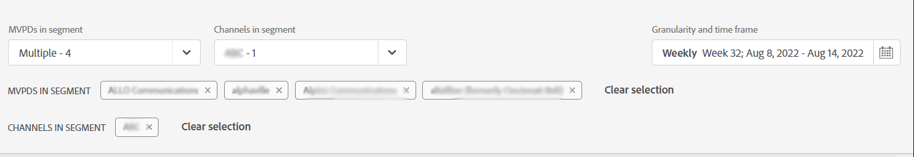
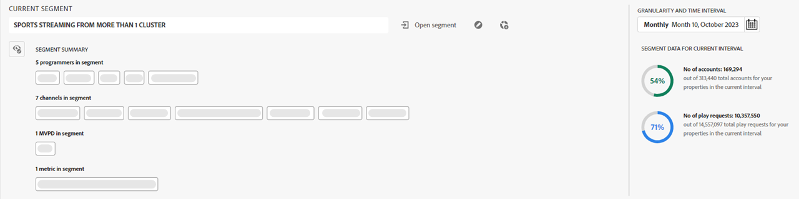

# Segmentos do assinante e intervalo de tempo {#cohorts-segments}

Ao fazer logon no Account IQ, há um painel na parte superior que permite definir o assinante [segmento](/help/accountiq/product-concepts.md#segment-segmet-def) para filtrar os resultados de visualização de relatórios para padrões e comportamento de compartilhamento do assinante.

<!---->

+++Painel de seleção de segmentos para Programador

<!---->

As opções suspensas a seguir são usadas para definir segmentos:

**[!UICONTROL MVPDs in segment]**

A variável **[!UICONTROL MVPDs in segment]** O seletor permite escolher o [MVPDs](/help/accountiq/product-concepts.md#mvpd-def) (pessoas físicas ou grupos) para cujo assinante você deseja exibir os relatórios de compartilhamento de conta.

Nesse seletor, além de selecionar os MVPDs individuais, você também pode selecionar os seguintes grupos:

* [Os 10 principais MVPDs por pontuação de compartilhamento](/help/accountiq/product-concepts.md#top-mvpds-def)

* [Os 10 principais MVPDs por uso](/help/accountiq/product-concepts.md#top-mvpds-def)

* [Os 10 principais MVPDs por contas](/help/accountiq/product-concepts.md#top-mvpds-def)

* [Modo de isolamento](/help/accountiq/isolation-mode.md)

**[!UICONTROL Channels in segment]**

Quando você está conectado como um usuário programador, é possível selecionar seus canais para exibir as análises de compartilhamento de conta. Use o **[!UICONTROL Channels in segment]** opção suspensa para selecionar canais individuais ou múltiplos na organização.

+++

+++Painel de seleção de segmentos para MVPDs

As opções suspensas a seguir são usadas para definir segmentos:

**[!UICONTROL Channels in segment]**

A variável **[!UICONTROL Channels in segment]** O seletor permite restringir ainda mais seu filtro para selecionar canais correspondentes aos MVPDs selecionados.

* [Os 10 principais programadores por pontuação de compartilhamento](/help/accountiq/product-concepts.md#top-mvpds-def)

* [Os 10 principais programadores por uso](/help/accountiq/product-concepts.md#top-mvpds-def)

* [Os 10 principais programadores por contas](/help/accountiq/product-concepts.md#top-mvpds-def)

**MVPD(s) no segmento**

Quando você estiver conectado como um usuário MVPD, seu nome será exibido no campo para **[!UICONTROL MVPDs in segment]**.

+++

<!--For example, you can define your segment as the "subscribers of the MVPD A that watched the channels X, Y, and Z".-->

## [!UICONTROL Granularity and time frame] {#granularity-timeframe}

A variável **[!UICONTROL Granularity and time frame]** o seletor permite especificar as datas e a duração, ou o tamanho de tempo, para as quais você deseja exibir o comportamento de compartilhamento do assinante.

![[!UICONTROL Granularity and timeframe]](assets/granularity-timeframe-weekwise.png)

Assim, com esses controles você pode definir sua declaração de problema como &quot;assinantes do MVPD A que assistiram aos canais X, Y e Z no mês de maio&quot;.

