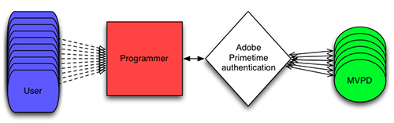

# Guia de integração do programador {#programmer-integration-guide}

>[!IMPORTANT]
>
> O conteúdo desta página é fornecido apenas para fins informativos. O uso desta API requer uma licença atual da Adobe. Não é permitida nenhuma utilização não autorizada.

Este guia de integração é destinado a provedores de conteúdo (programadores) que planejam integrar com a Autenticação de passagem Adobe®.

No cenário digital de hoje, os visualizadores podem acessar a Internet a qualquer hora, em qualquer lugar e solicitar acesso ao conteúdo protegido. Eles podem estar olhando para assistir a um evento único ou buscar os direitos para transmitir uma série de televisão inteira que você está transmitindo.

Antes de conceder acesso a um conteúdo protegido, você deve determinar se o visualizador tem direito a ele. As principais perguntas incluem:

* **O visualizador tem uma assinatura ativa com um Distribuidor de Programação de Vídeo Multicanal (MVPD)?**
* **Essa assinatura inclui sua programação?**

## Autenticação Adobe Pass para TV em todos os lugares {#adobe-pass-authentication-for-tv-everywhere}

Para programadores, determinar o direito nem sempre é simples. Os MVPDs são os responsáveis pelos dados de identificação e privilégios de acesso de seus clientes. Para complicar ainda mais a situação, os telespectadores dos programadores podem assinar uma grande variedade de MVPDs, cada um operando com sistemas únicos. Essas complexidades tornam a verificação de direitos tecnicamente desafiadora e exigente em recursos.

{align="center"}

*Direito De Usuário Determinado Diretamente Pelo Programador*

A autenticação do Adobe Pass facilita com segurança as transações de direitos entre programadores e MVPDs, tornando rápido, fácil e seguro o fornecimento de conteúdo protegido a visualizadores elegíveis.

{align="center"}

*Direitos de Usuário Mediados pela Autenticação Adobe Pass*

A Autenticação do Adobe Pass atua como proxy e facilita o fluxo de direitos entre Programadores e MVPDs, oferecendo interfaces seguras e consistentes para ambas as partes.

Para Programadores, a Autenticação do Adobe Pass fornece APIs como parte de uma camada **Standard** ou **Premium**:

* APIs padrão de autenticação da Adobe Pass:
   * [DCR DA API REST](/help/authentication/integration-guide-programmers/rest-apis/rest-api-dcr/dynamic-client-registration-overview.md)
   * [REST API V2](/help/authentication/integration-guide-programmers/rest-apis/rest-api-v2/apis/rest-api-v2-apis-overview.md)

* APIs de autenticação Premium do Adobe Pass:
   * [Redefinir API Temp Pass](/help/authentication/integration-guide-programmers/features-premium/temporary-access/temp-pass-feature.md#reset-tempass-api-access)
   * [API de degradação](/help/authentication/integration-guide-programmers/features-premium/degraded-access/degradation-feature.md#degradation-api-access)
   * [API de monitoramento do serviço de qualificação](/help/authentication/integration-guide-programmers/features-premium/esm/entitlement-service-monitoring-api.md)

### Casos de uso {#use-cases}

Esta seção descreve mais detalhadamente os casos de uso de integração do Programador compatíveis com a Autenticação do Adobe Pass:

* Aplicativo de programador (TVE) com uma rede de canal único

  Isso permite que o programador forneça aos visualizadores acesso ao conteúdo de uma rede de canal de marca única em um aplicativo TVE.

* Aplicativo de programador (TVE) com várias redes de canal

  Isso permite que o programador forneça aos visualizadores acesso ao conteúdo de várias redes de canal em um único aplicativo TVE.

* Aplicativo de programador (TVE) para eventos especiais

  Isso permite que o programador forneça aos visualizadores acesso ao conteúdo de eventos especiais que podem não ser recursos do banco de dados de direitos do MVPD, como canais normais.

| **Fase** | **Prioridade** | **Caso de uso** | **Documentos** |
|----------------------|--------------|-------------------------------------------------------------------------|----------------------------------------------------------------------------------------------------------------------------------------------------------------------------------|
| **Autenticação** | **Alta** | Autenticação | Para obter mais detalhes, consulte os documentos agregados na seção [Fase de autenticação](#authentication-phase). |
|                      | **Alta** | Autenticação baseada em casa (HBA) | Para obter mais detalhes, consulte a [Autenticação baseada em página inicial](/help/authentication/integration-guide-programmers/features-standard/hba-access/home-based-authentication.md). |
|                      | **Alta** | Logon único (SSO) | Para obter mais detalhes, consulte os documentos agregados na seção [Logon Único (SSO)](#sso). |
|                      | **Alta** | Selecionar MVPD | Para obter mais detalhes, consulte os documentos agregados na seção [Fase de Configuração](#configuration-phase). |
|                      | **Medium** | Página de logon com marca MVPD | Permite que os MVPDs forneçam páginas de logon com marcas específicas para o Programador ou provedor de serviços, incluindo suporte para preferências de idioma padrão. |
|                      | **Alta** | Configurar valores de TTL (Time-To-Live) por plataforma | Para obter mais detalhes, consulte o [Guia do Usuário de Integrações do Painel da TVE](/help/authentication/user-guide-tve-dashboard/tve-dashboard-integrations.md#most-used-flows). |
| **Pré-autorização** | **Baixo** | Pré-autorização (Autorização de Comprovação) | Para obter mais detalhes, consulte os documentos agregados na seção [Fase de Pré-autorização](#preauthorization-phase). |
|                      | **Medium** | Códigos de erro aprimorados | Para obter mais detalhes, consulte os [Códigos de Erro Aprimorados](/help/authentication/integration-guide-programmers/features-standard/error-reporting/enhanced-error-codes.md). |
| **Autorização** | **Alta** | Autorização | Para obter mais detalhes, consulte os documentos agregados na seção [Fase de Autorização](#authorization-phase). |
|                      | **Alta** | Autorização de canal distinto | Permite que os usuários acessem o conteúdo de várias redes de canal em um único aplicativo TVE. Os programadores podem fazer chamadas de autorização específicas do canal para verificar os direitos. |
|                      | **Baixo** | Autorização no nível do ativo | Permite que os MVPDs coletem análises detalhadas para ativos de conteúdo individuais durante a autorização. |
|                      | **Medium** | Códigos de erro aprimorados | Para obter mais detalhes, consulte os [Códigos de Erro Aprimorados](/help/authentication/integration-guide-programmers/features-standard/error-reporting/enhanced-error-codes.md). |
|                      | **Alta** | Programador Federated Player - Com Autorização No Nível Da Página | Para obter mais detalhes, consulte os [Tokens de mídia](/help/authentication/integration-guide-programmers/features-standard/entitlements/media-tokens.md). |
|                      | **Medium** | Programador Federated Player - Com Autorização Interna Do Player | Para obter mais detalhes, consulte os [Tokens de mídia](/help/authentication/integration-guide-programmers/features-standard/entitlements/media-tokens.md). |
|                      | **Alta** | Player sindicalizado - hospedado no MVPD Portal com autorização em nível de página | Para obter mais detalhes, consulte os [Tokens de mídia](/help/authentication/integration-guide-programmers/features-standard/entitlements/media-tokens.md). |
|                      | **Baixo** | Controle pelos pais - Classificações de conteúdo em solicitações de autorização | Permite que o Programador inclua classificações de conteúdo como parte da solicitação de autorização para o MVPD, que são úteis para autorização no nível do ativo. |
|                      | **Baixo** | Controle pelos pais - Filtragem de conteúdo com base nos atributos do usuário | Permite que o programador verifique a classificação máxima de conteúdo permitida para um usuário e filtre o conteúdo disponível de acordo. |
| **Logoff** | **Medium** | Sair | Para obter mais detalhes, consulte os documentos agregados na seção [Fase de Saída](#logout-phase). |

## Fluxo de direitos {#entitlement-flow}

O fluxo de qualificação é uma série de etapas que um aplicativo de Programador (TVE) deve concluir para transmitir conteúdo protegido. O fluxo consiste nas seguintes fases:

* [Fase de registro](#registration-phase)
* [Fase de configuração](#configuration-phase)
* [Fase de autenticação](#authentication-phase)
* [(Opcional) Fase de pré-autorização](#preauthorization-phase)
* [Fase de autorização](#authorization-phase)
* [Fase de saída](#logout-phase)

Na visita inicial de um usuário a um aplicativo de Programador (TVE), o fluxo de direito segue a sequência descrita. No entanto, em visitas subsequentes, o aplicativo pode ignorar determinadas etapas com base no status do registro ou da autenticação e nas políticas de visualização aplicáveis.

Para obter uma exploração detalhada do fluxo de direitos e suas fases, continue lendo este documento e, depois de consultar os guias do guia de receitas que o acompanham para obter insights adicionais:

* [Cookbook REST API V2 (cliente para servidor)](/help/authentication/integration-guide-programmers/rest-apis/rest-api-v2/cookbooks/rest-api-v2-cookbook-client-server.md)
* [Cookbook REST API V2 (servidor para servidor)](/help/authentication/integration-guide-programmers/rest-apis/rest-api-v2/cookbooks/rest-api-v2-cookbook-server-server.md)

>[!NOTE]
>
> O aplicativo Programador (TVE) é usado neste documento para se referir coletivamente aos tipos de aplicativos em execução em diferentes plataformas (navegadores, dispositivos móveis, dispositivos conectados à TV etc.) compatíveis com a Autenticação Adobe Pass.

### Fase de registro {#registration-phase}

A finalidade da Fase de Registro é registrar o aplicativo cliente na Autenticação Adobe Pass por meio do [processo de Registro Dinâmico de Cliente (DCR)](/help/authentication/integration-guide-programmers/rest-apis/rest-api-dcr/dynamic-client-registration-overview.md).

O processo de Registro dinâmico de cliente (DCR) exige que o aplicativo cliente obtenha um par de credenciais de cliente e recupere um token de acesso como meta final da fase de registro.

**APIs**

* [Recuperar credenciais do cliente](/help/authentication/integration-guide-programmers/rest-apis/rest-api-dcr/apis/dynamic-client-registration-apis-retrieve-client-credentials.md)
* [Recuperar token de acesso](/help/authentication/integration-guide-programmers/rest-apis/rest-api-dcr/apis/dynamic-client-registration-apis-retrieve-access-token.md)

**Fluxos**

* [Fluxo dinâmico de registro de cliente](/help/authentication/integration-guide-programmers/rest-apis/rest-api-dcr/flows/dynamic-client-registration-flow.md)

**Perguntas frequentes**

* [Perguntas frequentes sobre a fase de registro](/help/authentication/integration-guide-programmers/rest-apis/rest-api-v2/rest-api-v2-faqs.md#registration-phase-faqs-general).

### Fase de configuração {#configuration-phase}

A finalidade da Fase de configuração é fornecer ao aplicativo cliente a lista de MVPDs com os quais ele está ativamente integrado, juntamente com os detalhes de configuração salvos pela Autenticação Adobe Pass para cada MVPD.

A Fase de configuração atua como uma etapa de pré-requisito para a Fase de autenticação quando o aplicativo cliente precisa solicitar que o usuário selecione o Provedor de TV.

**APIs**

* [Recuperar configuração para provedor de serviços específico](/help/authentication/integration-guide-programmers/rest-apis/rest-api-v2/apis/configuration-apis/rest-api-v2-configuration-apis-retrieve-configuration-for-specific-service-provider.md)

**Perguntas frequentes**

* [Perguntas frequentes sobre a fase de configuração](/help/authentication/integration-guide-programmers/rest-apis/rest-api-v2/rest-api-v2-faqs.md#configuration-phase-faqs-general).

>[!TIP]
>
> O aplicativo TVE deve incluir uma interface de seleção de MVPD, permitindo que os usuários identifiquem e selecionem facilmente seu provedor de TV.

### Fase de autenticação {#authentication-phase}

A finalidade da Fase de autenticação é fornecer ao aplicativo cliente a capacidade de verificar a identidade do usuário com a MVPD e obter informações de metadados do usuário.

A Fase de autenticação atua como uma etapa de pré-requisito para a Fase de pré-autorização ou Fase de autorização quando o aplicativo cliente precisa reproduzir o conteúdo.

A autenticação bem-sucedida gera um perfil vinculado ao aplicativo, dispositivo e provedor de serviços, contendo também informações de metadados do usuário.

**Etapas de alto nível**

As etapas a seguir descrevem as etapas de alto nível no caso de uma integração SAML:

1. **Carregamento do Aplicativo (Site) do Programador**\
   O usuário navega até o aplicativo (site) do Programador, que integra a [API REST V2](/help/authentication/integration-guide-programmers/rest-apis/rest-api-v2/rest-api-v2-overview.md) de Autenticação do Adobe Pass.

1. **Solicitação de conteúdo protegido**\
   Quando o usuário tenta acessar um conteúdo protegido, o aplicativo do Programador exibe uma lista de MVPDs que o usuário pode selecionar.

1. **Inicialização da Solicitação de Autenticação**\
   Após a seleção do MVPD, o usuário é redirecionado para um servidor de Autenticação Adobe Pass. Aqui, uma solicitação de autenticação SAML criptografada para o MVPD selecionado é gerada, no caso de uma integração SAML. Essa solicitação é enviada em nome do Programador para a MVPD. Dependendo do sistema do MVPD, o navegador do usuário é redirecionado para a página de logon do MVPD ou um iFrame de logon é incorporado no aplicativo do Programador.

1. **Logon do MVPD**\
   O MVPD aceita a solicitação e apresenta sua interface de logon, via redirecionamento ou iFrame.

1. **Logon e validação do usuário**\
   O usuário faz logon com suas credenciais da MVPD. O MVPD valida o status de subscrição do usuário e estabelece sua própria sessão HTTP.

1. **Resposta do MVPD à Autenticação do Adobe Pass**\
   Quando a validação for concluída, o MVPD gerará uma resposta SAML (criptografada) e a enviará de volta para a Autenticação Adobe Pass.

1. **Geração de perfil**\
   A Autenticação do Adobe Pass verifica a resposta SAML, gera um perfil de usuário que é armazenado em cache e redireciona o usuário para o aplicativo do Programador (site).

**APIs**

* [Criar sessão de autenticação](/help/authentication/integration-guide-programmers/rest-apis/rest-api-v2/apis/sessions-apis/rest-api-v2-sessions-apis-create-authentication-session.md)
* [Retomar sessão de autenticação](/help/authentication/integration-guide-programmers/rest-apis/rest-api-v2/apis/sessions-apis/rest-api-v2-sessions-apis-resume-authentication-session.md)
* [Recuperar sessão de autenticação](/help/authentication/integration-guide-programmers/rest-apis/rest-api-v2/apis/sessions-apis/rest-api-v2-sessions-apis-retrieve-authentication-session-information-using-code.md)
* [Executar autenticação no agente do usuário](/help/authentication/integration-guide-programmers/rest-apis/rest-api-v2/apis/sessions-apis/rest-api-v2-sessions-apis-perform-authentication-in-user-agent.md)
* [Recuperar perfis](/help/authentication/integration-guide-programmers/rest-apis/rest-api-v2/apis/profiles-apis/rest-api-v2-profiles-apis-retrieve-profiles.md)
* [Recuperar perfil para mvpd específico](/help/authentication/integration-guide-programmers/rest-apis/rest-api-v2/apis/profiles-apis/rest-api-v2-profiles-apis-retrieve-profile-for-specific-mvpd.md)
* [Recuperar perfil para código específico](/help/authentication/integration-guide-programmers/rest-apis/rest-api-v2/apis/profiles-apis/rest-api-v2-profiles-apis-retrieve-profile-for-specific-code.md)

**Fluxos**

* [Fluxo de autenticação básica executado no aplicativo principal](/help/authentication/integration-guide-programmers/rest-apis/rest-api-v2/flows/basic-access-flows/rest-api-v2-basic-authentication-primary-application-flow.md)
* [Fluxo de autenticação básico executado no aplicativo secundário](/help/authentication/integration-guide-programmers/rest-apis/rest-api-v2/flows/basic-access-flows/rest-api-v2-basic-authentication-secondary-application-flow.md)
* [Fluxo de perfis básicos realizado no aplicativo principal](/help/authentication/integration-guide-programmers/rest-apis/rest-api-v2/flows/basic-access-flows/rest-api-v2-basic-profiles-primary-application-flow.md)
* [Fluxo de perfis básicos realizado no aplicativo secundário](/help/authentication/integration-guide-programmers/rest-apis/rest-api-v2/flows/basic-access-flows/rest-api-v2-basic-profiles-secondary-application-flow.md)

**Perguntas frequentes**

* [Perguntas frequentes sobre a fase de autenticação](/help/authentication/integration-guide-programmers/rest-apis/rest-api-v2/rest-api-v2-faqs.md#authentication-phase-faqs-general).

>[!TIP]
>
> O aplicativo TVE deve transmitir o status de autenticação do usuário claramente, por exemplo, exibindo seu logotipo do MVPD ao lado de ícones &quot;bloqueados&quot; ou &quot;desbloqueados&quot; para indicar a acessibilidade do conteúdo protegido.

#### Logon único (SSO) {#single-sign-on}

**APIs**

* [Recuperar solicitação de autenticação do parceiro](/help/authentication/integration-guide-programmers/rest-apis/rest-api-v2/apis/partner-single-sign-on-apis/rest-api-v2-partner-single-sign-on-apis-retrieve-partner-authentication-request.md)
* [Criar e recuperar perfil usando a resposta de autenticação do parceiro](/help/authentication/integration-guide-programmers/rest-apis/rest-api-v2/apis/partner-single-sign-on-apis/rest-api-v2-partner-single-sign-on-apis-retrieve-profile-using-partner-authentication-response.md)

**Fluxos**

* [Logon único usando fluxos de parceiros](/help/authentication/integration-guide-programmers/rest-apis/rest-api-v2/flows/single-sign-on-access-flows/rest-api-v2-single-sign-on-partner-flows.md)
* [Logon único usando fluxos de identidade da plataforma](/help/authentication/integration-guide-programmers/rest-apis/rest-api-v2/flows/single-sign-on-access-flows/rest-api-v2-single-sign-on-platform-identity-flows.md)
* [Logon único usando fluxos de token de serviço](/help/authentication/integration-guide-programmers/rest-apis/rest-api-v2/flows/single-sign-on-access-flows/rest-api-v2-single-sign-on-service-token-flows.md)

### (Opcional) Fase de pré-autorização {#preauthorization-phase}

O objetivo da Fase de pré-autorização é fornecer ao aplicativo cliente a capacidade de apresentar um subconjunto de recursos de seu catálogo que o usuário teria direito de acessar.

A Fase de pré-autorização pode aprimorar a experiência do usuário quando ele abre o aplicativo do cliente pela primeira vez ou navega para uma nova seção.

**APIs**

* [Recuperar decisões de pré-autorização](/help/authentication/integration-guide-programmers/rest-apis/rest-api-v2/apis/decisions-apis/rest-api-v2-decisions-apis-retrieve-preauthorization-decisions-using-specific-mvpd.md)

**Fluxos**

* [Fluxo básico de pré-autorização executado no aplicativo principal](/help/authentication/integration-guide-programmers/rest-apis/rest-api-v2/flows/basic-access-flows/rest-api-v2-basic-preauthorization-primary-application-flow.md)

**Perguntas frequentes**

* [Perguntas frequentes da fase de pré-autorização](/help/authentication/integration-guide-programmers/rest-apis/rest-api-v2/rest-api-v2-faqs.md#preauthorization-phase-faqs-general).

>[!TIP]
>
> O aplicativo TVE deve diferenciar claramente o conteúdo restrito do conteúdo autorizado por meio de indicadores visuais, como um ícone &quot;bloqueado&quot; para o conteúdo restrito e um ícone &quot;desbloqueado&quot; para o conteúdo autorizado.

### Fase de autorização {#authorization-phase}

A finalidade da Fase de autorização é fornecer ao aplicativo cliente a capacidade de reproduzir recursos que o usuário solicita após validar seus direitos com o MVPD.

Uma autorização bem-sucedida gera uma decisão, que também contém um token de mídia fornecido ao aplicativo Programador (TVE) para fins de segurança.

**Etapas de alto nível**

As etapas a seguir descrevem as etapas de alto nível:

1. **Tratamento do Identificador de Recursos**\
   O conteúdo protegido é identificado por um [identificador de recurso](/help/authentication/integration-guide-programmers/features-standard/entitlements/decisions.md#resource-identifier), que pode ser uma cadeia de caracteres simples ou uma estrutura mais complexa. Esse identificador é predefinido e acordado entre o Programador e a MVPD. O aplicativo do Programador envia o identificador de recurso para a [REST API V2](/help/authentication/integration-guide-programmers/rest-apis/rest-api-v2/rest-api-v2-overview.md) da Autenticação do Adobe Pass.

1. **Verificação de autorização do MVPD**\
   O servidor de autenticação da Adobe Pass se comunica com o endpoint de autorização da MVPD usando protocolos padronizados.

1. **Resposta do MVPD à Autenticação do Adobe Pass**\
   Quando a validação for concluída, o MVPD confirmará se o usuário tem direito (ou não) de acessar o conteúdo e enviará uma resposta para a Autenticação Adobe Pass.

1. **Geração de token de mídia e decisão**\
   A Autenticação da Adobe Pass verifica a resposta, gera uma [decisão](/help/authentication/integration-guide-programmers/features-standard/entitlements/decisions.md) que é armazenada em cache e retorna a decisão que contém um token de mídia de volta ao aplicativo do Programador (site).

1. **Verificação de acesso ao conteúdo**\
   O aplicativo do Programador usa o [Verificador de Token de Mídia](/help/authentication/integration-guide-programmers/features-standard/entitlements/media-tokens.md#media-token-verifier) para confirmar se o usuário correto está acessando o conteúdo correto. Depois de validado, o usuário recebe acesso para visualizar o conteúdo protegido.

**APIs**

* [Recuperar decisões de autorização](/help/authentication/integration-guide-programmers/rest-apis/rest-api-v2/apis/decisions-apis/rest-api-v2-decisions-apis-retrieve-authorization-decisions-using-specific-mvpd.md)

**Fluxos**

* [Fluxo de autorização básico executado no aplicativo principal](/help/authentication/integration-guide-programmers/rest-apis/rest-api-v2/flows/basic-access-flows/rest-api-v2-basic-authorization-primary-application-flow.md)

**Perguntas frequentes**

* [Perguntas frequentes sobre a fase de autorização](/help/authentication/integration-guide-programmers/rest-apis/rest-api-v2/rest-api-v2-faqs.md#authorization-phase-faqs-general).

>[!TIP]
>
> O aplicativo TVE deve diferenciar claramente o conteúdo restrito do conteúdo autorizado por meio de indicadores visuais, como um ícone &quot;bloqueado&quot; para o conteúdo restrito e um ícone &quot;desbloqueado&quot; para o conteúdo autorizado.

### Fase de saída {#logout-phase}

A finalidade da Fase de logout é fornecer ao aplicativo cliente a capacidade de encerrar o perfil autenticado do usuário na Autenticação do Adobe Pass mediante solicitação do usuário.

**APIs**

* [Iniciar logout para mvpd específico](/help/authentication/integration-guide-programmers/rest-apis/rest-api-v2/apis/logout-apis/rest-api-v2-logout-apis-initiate-logout-for-specific-mvpd.md)

**Fluxos**

* [Fluxo de logout básico executado no aplicativo principal](/help/authentication/integration-guide-programmers/rest-apis/rest-api-v2/flows/basic-access-flows/rest-api-v2-basic-logout-primary-application-flow.md)

**Perguntas frequentes**

* [Perguntas frequentes sobre a fase de logoff](/help/authentication/integration-guide-programmers/rest-apis/rest-api-v2/rest-api-v2-faqs.md#logout-phase-faqs-general).

#### Logout único (SLO) {#single-logout}

**Fluxos**

* [Fluxo de logout único](/help/authentication/integration-guide-programmers/rest-apis/rest-api-v2/flows/single-sign-on-access-flows/rest-api-v2-single-sign-on-logout-flow.md)

## Noções básicas sobre direitos {#understanding-entitlements}

A solução Adobe Pass Authentication baseia-se na criação de direitos — dados específicos gerados após a conclusão bem-sucedida de workflows de autenticação e autorização. Esses direitos concedem acesso a conteúdo protegido, mas têm um tempo de vida limitado. Quando um direito expira, ele deve ser renovado reiniciando os processos de autenticação ou autorização.

Para obter mais informações sobre direitos, consulte os seguintes documentos:

* **Perfis**

  Após a autenticação bem-sucedida, a Autenticação do Adobe Pass cria um perfil autenticado (&quot;duradouro&quot;) associado ao aplicativo solicitante, ao dispositivo e ao identificador do provedor de serviços (identificador do solicitante).

* **[Metadados de usuário](/help/authentication/integration-guide-programmers/features-standard/entitlements/user-metadata.md)**

  Após a autenticação bem-sucedida (e em alguns casos também após a autorização), a Autenticação do Adobe Pass recebe metadados do usuário da MVPD que podem expô-los ao aplicativo solicitante.

* **[Decisões](/help/authentication/integration-guide-programmers/features-standard/entitlements/decisions.md)**

  Após a autorização bem-sucedida, a Autenticação do Adobe Pass cria uma decisão de autorização (&quot;longa vida&quot;) associada ao aplicativo solicitante, dispositivo, identificador de provedor de serviços (identificador do solicitante) e um recurso protegido específico (identificador de recursos).

* **[Tokens de mídia](/help/authentication/integration-guide-programmers/features-standard/entitlements/media-tokens.md)**

  Após a autorização bem-sucedida, a Autenticação do Adobe Pass cria um token de mídia (&quot;vida curta&quot;) associado a uma solicitação de reprodução bem-sucedida.
