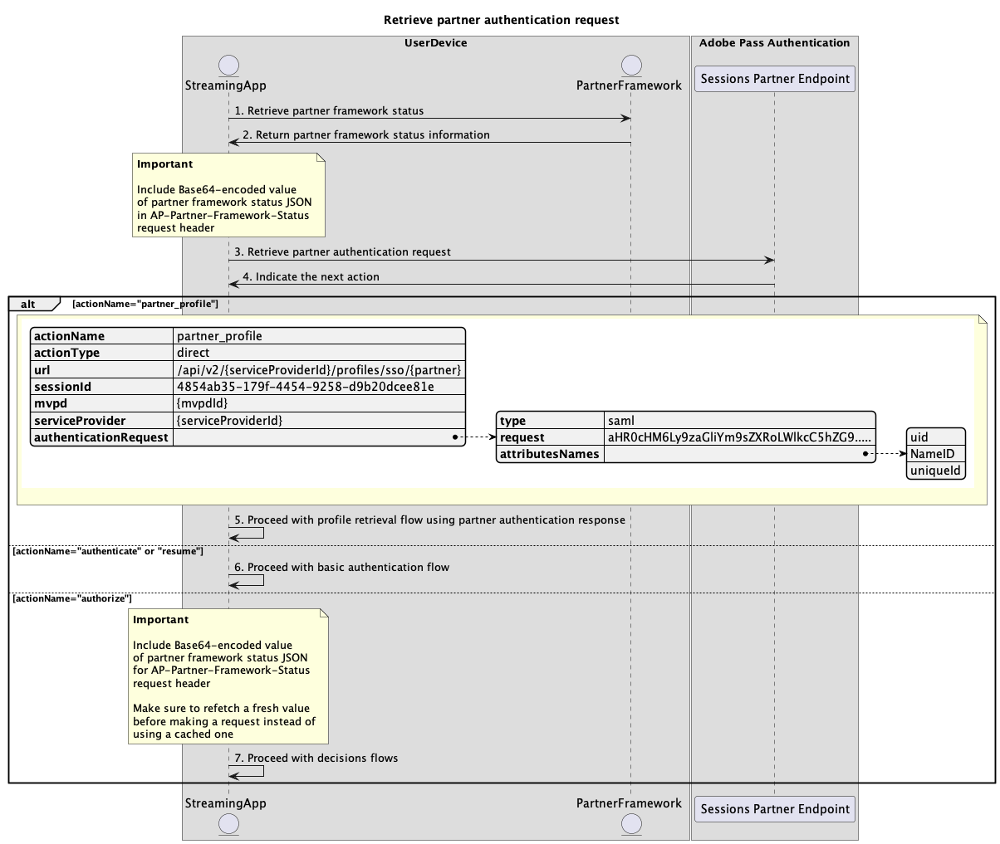

# Logon único usando fluxos de parceiros {#single-sign-on-partner-flows}

>[!IMPORTANT]
>
> O conteúdo desta página é fornecido apenas para fins informativos. O uso desta API requer uma licença atual do Adobe. Não é permitida nenhuma utilização não autorizada.

>[!IMPORTANT]
>
> A implementação da REST API V2 é limitada pela documentação do [Mecanismo de limitação](/help/authentication/integration-guide-programmers/throttling-mechanism.md).

O método Parceiro permite que vários aplicativos usem uma carga de status da estrutura do parceiro para obter logon único (SSO) no nível do dispositivo ao usar os serviços da Adobe Pass.

Os aplicativos são responsáveis por recuperar a carga de status da estrutura do parceiro usando estruturas específicas do parceiro ou bibliotecas fora dos sistemas Adobe Pass.

Os aplicativos são responsáveis por incluir essa carga de status de estrutura de parceiro como parte do cabeçalho `AP-Partner-Framework-Status` para todas as solicitações que a especificam.

Para obter mais detalhes sobre o cabeçalho `AP-Partner-Framework-Status`, consulte a documentação [AP-Partner-Framework-Status](../../appendix/headers/rest-api-v2-appendix-headers-ap-partner-framework-status.md).

A API REST V2 de autenticação do Adobe Pass tem suporte para Logon único de parceiro (SSO) para usuários finais de aplicativos clientes em execução no iOS, iPadOS ou tvOS.

Para obter mais detalhes sobre o logon único (SSO) para a plataforma Apple, consulte a [Documentação do Guia de SSO do Apple (REST API V2)](/help/authentication/integration-guide-programmers/features-standard/sso-access/partner-sso/apple-sso/apple-sso-cookbook-rest-api-v2.md).

## Recuperar solicitação de autenticação do parceiro {#retrieve-partner-authentication-request}

### Pré-requisitos {#prerequisites-retrieve-partner-authentication-request}

Antes de recuperar a solicitação de autenticação do parceiro, verifique se os seguintes pré-requisitos foram atendidos:

* A estrutura do parceiro deve selecionar um MVPD.
* O aplicativo de transmissão deve obter as informações de status da estrutura do parceiro da estrutura do parceiro e transmiti-las para o servidor do Adobe Pass.
* O aplicativo de transmissão deve obter a solicitação de autenticação de parceiro do servidor do Adobe Pass e transmiti-la para a estrutura do parceiro.

>[!IMPORTANT]
>
> Suposições
> 
>  
> 
> * A estrutura do parceiro é compatível com a interação do usuário para selecionar um MVPD.
> * A estrutura do parceiro oferece suporte à interação do usuário para autenticação com o MVPD selecionado.
> * A estrutura do parceiro fornece permissão de usuário e informações do provedor.

### Fluxo de trabalho (WRK) {#workflow-retrieve-partner-authentication-request}

Execute as etapas fornecidas para recuperar a solicitação de autenticação do parceiro, conforme mostrado no diagrama a seguir.

*Recuperar solicitação de autenticação de parceiro*

1. **Recuperar status da estrutura do parceiro:** O aplicativo de streaming chama a estrutura do parceiro, fora dos sistemas Adobe Pass, para obter permissão do usuário e informações do provedor.

1. **Retornar informações de status da estrutura do parceiro:** o aplicativo de streaming valida os dados de resposta para garantir que as condições básicas sejam atendidas:
   * O status de acesso da permissão do usuário é concedido.
   * O identificador de mapeamento do provedor do usuário está presente e é válido.
   * A data de expiração do perfil do provedor do usuário (se disponível) é válida.

1. **Recuperar solicitação de autenticação do parceiro:** o aplicativo de streaming reúne todos os dados necessários para iniciar uma sessão de autenticação chamando o ponto de extremidade Parceiro de Sessões.

   >[!IMPORTANT]
   >
   > Consulte a [Recuperar solicitação de autenticação do parceiro](../../apis/partner-single-sign-on-apis/rest-api-v2-partner-single-sign-on-apis-retrieve-partner-authentication-request.md) documentação da API para obter detalhes sobre:
   >
   > * Todos os parâmetros _necessários_, como `serviceProvider` e `partner`
   > * Todos os cabeçalhos _necessários_ como `Authorization`, `AP-Device-Identifier`, `Content-Type`, `X-Device-Info` e `AP-Partner-Framework-Status`
   > * Todos os cabeçalhos e parâmetros _opcionais_
   >
   >  
   >
   > A aplicação de transmissão deve garantir que inclua um valor válido para o status da estrutura do parceiro antes de fazer uma solicitação.
   >
   >  
   > 
   > Para obter mais detalhes sobre o cabeçalho `AP-Partner-Framework-Status`, consulte a documentação [AP-Partner-Framework-Status](../../appendix/headers/rest-api-v2-appendix-headers-ap-partner-framework-status.md).

1. **Indique a próxima ação:** A resposta do ponto de extremidade do Parceiro de Sessões contém os dados necessários para orientar o aplicativo de streaming em relação à próxima ação.

   >[!IMPORTANT]
   >
   > Consulte a [Recuperar solicitação de autenticação do parceiro](../../apis/partner-single-sign-on-apis/rest-api-v2-partner-single-sign-on-apis-retrieve-partner-authentication-request.md) documentação da API para obter detalhes sobre as informações fornecidas na resposta da sessão.
   > 
   >  
   > 
   > O endpoint do Parceiro de sessões valida os dados da solicitação para garantir que as condições básicas sejam atendidas:
   >
   > * Os parâmetros e cabeçalhos _requeridos_ devem ser válidos.
   > * A integração entre o `serviceProvider` e o `mvpd` fornecidos deve estar ativa.
   >
   >  
   > 
   > Se a validação básica falhar, uma resposta de erro será gerada, fornecendo informações adicionais que seguem a [documentação de Códigos de erro aprimorados](../../../../features-standard/error-reporting/enhanced-error-codes.md).
   >
   >  
   >
   > O endpoint do Parceiro de sessões valida os dados da solicitação para garantir que as condições de logon único do parceiro sejam atendidas:
   >
   >  * A configuração de logon único do parceiro no servidor do Adobe Pass deve ser válida e ativada.
   >  * A carga de status da estrutura do parceiro recebida por meio do cabeçalho [AP-Partner-Framework-Status](../../appendix/headers/rest-api-v2-appendix-headers-ap-partner-framework-status.md) deve ser válida.
   >
   >  
   >
   > Se a validação do logon único do parceiro falhar, a resposta assumirá como padrão o fluxo de autenticação básico.

1. **Continue com o fluxo de recuperação de perfil usando a resposta de autenticação de parceiro:** A resposta do ponto de extremidade do Parceiro de Sessões contém os seguintes dados:
   * O atributo `actionName` está definido como &quot;partner_profile&quot;.
   * O atributo `actionType` está definido como &quot;direto&quot;.
   * O atributo `authenticationRequest - type` inclui o protocolo de segurança usado pela estrutura do parceiro para logon MVPD (atualmente definido somente como SAML).
   * O atributo `authenticationRequest - request` inclui a solicitação SAML passada para a estrutura do parceiro.
   * O atributo `authenticationRequest - attributesNames` inclui os atributos SAML passados para a estrutura do parceiro.

   Se o back-end do Adobe Pass não identificar um perfil válido e a validação de logon único de parceiro passar, o aplicativo de streaming receberá uma resposta com ações e dados para transmitir à estrutura do parceiro para iniciar o fluxo de autenticação com o MVPD.

   Para obter mais detalhes sobre o fluxo de recuperação de perfil usando uma resposta de autenticação de parceiro, consulte a seção [Recuperar perfil usando resposta de autenticação de parceiro](#retrieve-profile-using-partner-authentication-response).

1. **Continuar com o fluxo de autenticação básico:** A resposta do ponto de extremidade do Parceiro de Sessões contém os seguintes dados:
   * O atributo `actionName` está definido como &quot;autenticar&quot; ou &quot;retomar&quot;.
   * O atributo `actionType` está definido como &quot;interativo&quot; ou &quot;direto&quot;.

   Se o back-end do Adobe Pass não identificar um perfil válido e a validação do logon único do parceiro falhar, o servidor do Adobe Pass voltará ao fluxo de autenticação básico.

   Para obter mais detalhes sobre o fluxo de autenticação básico, consulte os seguintes documentos:
   * [Executar autenticação no aplicativo principal](../basic-access-flows/rest-api-v2-basic-authentication-primary-application-flow.md)
   * [Realizar autenticação no aplicativo secundário com mvpd pré-selecionado](../basic-access-flows/rest-api-v2-basic-authentication-secondary-application-flow.md)
   * [Executar autenticação no aplicativo secundário sem mvpd pré-selecionado](../basic-access-flows/rest-api-v2-basic-authentication-secondary-application-flow.md)

1. **Continuar com fluxos de decisões:** A resposta do ponto de extremidade do Parceiro de Sessões contém os seguintes dados:
   * O atributo `actionName` está definido como &quot;autorize&quot;.
   * O atributo `actionType` está definido como &quot;direto&quot;.

   Se o back-end do Adobe Pass identificar um perfil válido, o aplicativo de transmissão não precisará reautenticar com o MVPD selecionado, pois já existe um perfil que pode ser usado para fluxos de decisões subsequentes.

   >[!IMPORTANT]
   >
   > A aplicação de transmissão deve garantir que inclua um valor válido para o status da estrutura do parceiro antes de fazer uma solicitação.
   >
   >  
   > 
   > Para obter mais detalhes sobre o cabeçalho `AP-Partner-Framework-Status`, consulte a documentação [AP-Partner-Framework-Status](../../appendix/headers/rest-api-v2-appendix-headers-ap-partner-framework-status.md).

## Recuperar perfil usando resposta de autenticação de parceiro {#retrieve-profile-using-partner-authentication-response}

### Pré-requisitos {#prerequisites-retrieve-profile-using-partner-authentication-response}

Antes de recuperar o perfil usando uma resposta de autenticação de parceiro, verifique se os seguintes pré-requisitos foram atendidos:

* A estrutura do parceiro deve executar autenticação com o MVPD selecionado.
* O aplicativo de transmissão deve obter a resposta de autenticação do parceiro juntamente com as informações de status da estrutura do parceiro e transmiti-la para o servidor do Adobe Pass.

>[!IMPORTANT]
>
> Suposição
>
> * A estrutura do parceiro é compatível com a interação do usuário para selecionar um MVPD.
> * A estrutura do parceiro oferece suporte à interação do usuário para autenticação com o MVPD selecionado.
> * A estrutura do parceiro fornece permissão de usuário e informações do provedor.

### Fluxo de trabalho (WRK) {#workflow-retrieve-profile-using-partner-authentication-response}

Execute as etapas fornecidas para implementar o fluxo de recuperação de perfil usando uma resposta de autenticação de parceiro, conforme mostrado no diagrama a seguir.

*Recuperar perfil autenticado usando a resposta de autenticação de parceiro*

1. **Conclua a autenticação MVPD com a estrutura do parceiro:** Se o fluxo de autenticação for bem-sucedido, a interação da estrutura do parceiro com o MVPD produzirá uma resposta de autenticação do parceiro (resposta SAML) que será retornada junto com as informações de status da estrutura do parceiro.

1. **Resposta de autenticação de parceiro de retorno:** o aplicativo de streaming valida os dados de resposta para garantir que as condições básicas sejam atendidas:
   * O status de acesso da permissão do usuário é concedido.
   * O identificador de mapeamento do provedor do usuário está presente e é válido.
   * A data de expiração do perfil do provedor do usuário (se disponível) é válida.

1. **Recuperar perfil usando a resposta de autenticação de parceiro:** O aplicativo de streaming reúne todos os dados necessários para criar e recuperar um perfil, chamando o ponto de extremidade Parceiro de Perfis.

   >[!IMPORTANT]
   >
   > Consulte a documentação da API [Recuperar perfil usando a resposta de autenticação de parceiro](../../apis/partner-single-sign-on-apis/rest-api-v2-partner-single-sign-on-apis-retrieve-profile-using-partner-authentication-response.md) para obter detalhes sobre:
   >
   > * Todos os parâmetros _necessários_, como `serviceProvider`, `partner` e `SAMLResponse`
   > * Todos os cabeçalhos _necessários_, como `Authorization`, `AP-Device-Identifier`, `Content-Type`, `X-Device-Info` e `AP-Partner-Framework-Status`
   > * Todos os cabeçalhos e parâmetros _opcionais_
   >
   >  
   > 
   > A aplicação de transmissão deve garantir que inclua um valor válido para o status da estrutura do parceiro antes de fazer uma solicitação.
   >
   >  
   > 
   > Para obter mais detalhes sobre o cabeçalho `AP-Partner-Framework-Status`, consulte a documentação [AP-Partner-Framework-Status](../../appendix/headers/rest-api-v2-appendix-headers-ap-partner-framework-status.md).

1. **Criar e salvar perfil do parceiro:** o servidor do Adobe Pass cria e salva um perfil do parceiro depois de garantir que todas as condições sejam atendidas.

1. **Retornar informações sobre o perfil do parceiro:** A resposta do ponto de extremidade Perfis contém informações sobre o perfil do parceiro, incluindo o atributo `type` definido como &quot;appleSSO&quot;.

   >[!IMPORTANT]
   >
   > Consulte a documentação da API [Recuperar perfil usando a resposta de autenticação de parceiro](../../apis/partner-single-sign-on-apis/rest-api-v2-partner-single-sign-on-apis-retrieve-profile-using-partner-authentication-response.md) para obter detalhes sobre as informações fornecidas em uma resposta de perfil.
   > 
   >  
   > 
   > O ponto de extremidade Profiles Partner valida os dados da solicitação para garantir que as condições básicas sejam atendidas:
   >
   > * Os parâmetros e cabeçalhos _requeridos_ devem ser válidos.
   > * A integração entre o `serviceProvider` e o `mvpd` fornecidos deve estar ativa.
   >
   >  
   > 
   > Se a validação falhar, uma resposta de erro será gerada, fornecendo informações adicionais que seguem a documentação de [Códigos de erro aprimorados](../../../../features-standard/error-reporting/enhanced-error-codes.md).
   >
   >  
   >
   > O ponto de extremidade do Parceiro de perfis valida os dados da solicitação para garantir que as condições de logon único do parceiro sejam atendidas:
   >
   >  * A configuração de logon único do parceiro no servidor do Adobe Pass deve ser válida e ativada.
   >  * A carga de status da estrutura do parceiro recebida por meio do cabeçalho [AP-Partner-Framework-Status](../../appendix/headers/rest-api-v2-appendix-headers-ap-partner-framework-status.md) deve ser válida.
   >
   >  
   >
   > Se a validação do logon único do parceiro falhar, a resposta assumirá como padrão o fluxo básico de recuperação do perfil.

1. **Continuar com fluxos de decisões:** o aplicativo de streaming pode continuar com fluxos de decisões subsequentes.

   >[!IMPORTANT]
   >
   > A aplicação de transmissão deve garantir que inclua um valor válido para o status da estrutura do parceiro antes de fazer uma solicitação.
   >
   >  
   > 
   > Para obter mais detalhes sobre o cabeçalho `AP-Partner-Framework-Status`, consulte a documentação [AP-Partner-Framework-Status](../../appendix/headers/rest-api-v2-appendix-headers-ap-partner-framework-status.md).
