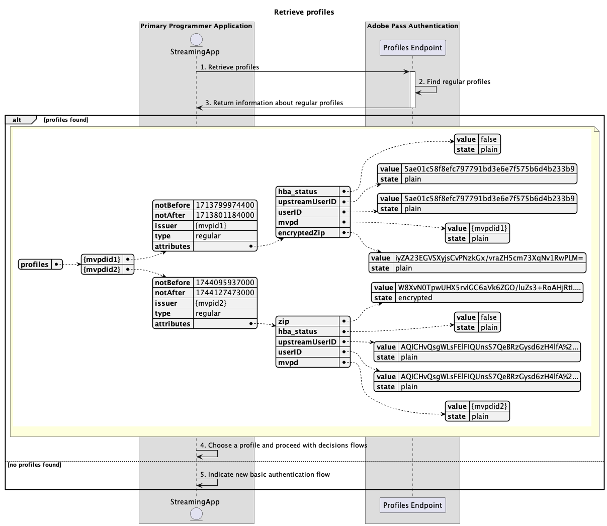

# Fluxo de perfis básicos realizado no aplicativo principal {#basic-profiles-flow-primary-application}

>[!IMPORTANT]
>
> O conteúdo desta página é fornecido apenas para fins informativos. O uso desta API requer uma licença atual do Adobe. Não é permitida nenhuma utilização não autorizada.

>[!IMPORTANT]
>
> A implementação da REST API V2 é limitada pela documentação do [Mecanismo de limitação](/help/authentication/throttling-mechanism.md).

O **Fluxo de perfis** dentro do direito de Autenticação Adobe Pass permite que o aplicativo de streaming acesse informações sobre logons de usuários ativos.

O fluxo de perfis básicos permite consultar os seguintes cenários:

* [Recuperar perfis](#retrieve-profiles)
* [Recuperar perfil para mvpd específico](#retrieve-profile-for-specific-mvpd)
* [Recuperar perfil para código específico](#retrieve-profile-for-specific-code)

## Recuperar perfis {#retrieve-profiles}

### Pré-requisitos {#prerequisites-retrieve-profiles}

Antes de recuperar perfis, verifique se os seguintes pré-requisitos foram atendidos:

* O aplicativo de streaming deseja recuperar todos os perfis comuns.

### Fluxo de trabalho (WRK) {#workflow-retrieve-profiles}

Siga as etapas fornecidas para implementar o fluxo de recuperação de perfis básicos executado em um aplicativo principal, conforme mostrado no diagrama a seguir.

*Recuperar perfis*

1. **Recuperar perfis:** o aplicativo de streaming reúne todos os dados necessários para recuperar todas as informações de perfil, enviando uma solicitação ao ponto de extremidade Perfis.

   >[!IMPORTANT]
   >
   > Consulte a documentação da API [Recuperar perfis](../../apis/profiles-apis/rest-api-v2-profiles-apis-retrieve-profiles.md) para obter detalhes sobre:
   >
   > * Todos os parâmetros _necessários_, como `serviceProvider`
   > * Todos os cabeçalhos _necessários_, como `Authorization`, `AP-Device-Identifier`
   > * Todos os _parâmetros e cabeçalhos_ opcionais

1. **Localizar perfis regulares:** O servidor do Adobe Pass identifica todos os perfis válidos com base nos parâmetros e cabeçalhos recebidos.

1. **Retornar informações sobre perfis regulares:** A resposta do ponto de extremidade Perfis contém informações sobre os perfis encontrados associados aos parâmetros e cabeçalhos recebidos.

   >[!IMPORTANT]
   >
   > Consulte a documentação da API [Recuperar perfis](../../apis/profiles-apis/rest-api-v2-profiles-apis-retrieve-profiles.md) para obter detalhes sobre as informações fornecidas na resposta do perfil.
   > 
   >  
   > 
   > O endpoint de Perfis valida os dados da solicitação para garantir que as condições básicas sejam atendidas:
   >
   > * Os parâmetros e cabeçalhos _requeridos_ devem ser válidos.
   >
   >  
   >
   > Se a validação falhar, uma resposta de erro será gerada, fornecendo informações adicionais que seguem a documentação de [Códigos de erro aprimorados](../../../enhanced-error-codes.md).

1. **Escolha um perfil e prossiga com os fluxos de decisões:** Se a resposta do ponto de extremidade Perfis contiver perfis, o aplicativo de streaming usará sua lógica interna (eventualmente interagindo com o usuário final) para escolher um dos perfis disponíveis para continuar com os fluxos de decisões subsequentes.

1. **Indicar novo fluxo de autenticação básico:** Se a resposta do ponto de extremidade Perfis não contiver um perfil, o aplicativo de streaming indicará ao usuário que ele iniciará um novo fluxo de autenticação básico.

## Recuperar perfil para mvpd específico {#retrieve-profile-for-specific-mvpd}

### Pré-requisitos {#prerequisites-retrieve-profile-for-specific-mvpd}

Antes de recuperar o perfil para um MVPD específico, verifique se os seguintes pré-requisitos foram atendidos:

* O aplicativo de streaming, que tem um identificador `mvpd` selecionado ou armazenado em cache, deseja recuperar o perfil regular de um MVPD específico.

### Fluxo de trabalho (WRK) {#workflow-retrieve-profile-for-specific-mvpd}

Siga as etapas fornecidas para implementar o fluxo básico de recuperação de perfil para um MVPD específico executado em um aplicativo principal, conforme mostrado no diagrama a seguir.

 específico

*Recuperar perfil para mvpd* específico

1. **Recuperar perfil para mvpd específico:** O aplicativo de streaming reúne todos os dados necessários para recuperar informações de perfil para esse MVPD específico, enviando uma solicitação para o ponto de extremidade de Perfis.

   >[!IMPORTANT]
   >
   > Consulte a [Recuperar perfil para a documentação específica da API mvpd](../../apis/profiles-apis/rest-api-v2-profiles-apis-retrieve-profile-for-specific-mvpd.md) para obter detalhes sobre:
   >
   > * Todos os parâmetros _necessários_, como `serviceProvider` e `mvpd`
   > * Todos os cabeçalhos _necessários_, como `Authorization`, `AP-Device-Identifier`
   > * Todos os _parâmetros e cabeçalhos_ opcionais

1. **Localizar perfil regular:** O servidor Adobe Pass identifica um perfil válido com base nos parâmetros e cabeçalhos recebidos.

1. **Retornar informações sobre o perfil regular:** A resposta do ponto de extremidade Perfis contém informações sobre o perfil encontrado associado aos parâmetros e cabeçalhos recebidos.

   >[!IMPORTANT]
   >
   > Consulte a [Recuperar perfil para a documentação específica da API do mvpd](../../apis/profiles-apis/rest-api-v2-profiles-apis-retrieve-profile-for-specific-mvpd.md) para obter detalhes sobre as informações fornecidas na resposta do perfil.
   > 
   >  
   > 
   > O endpoint de Perfis valida os dados da solicitação para garantir que as condições básicas sejam atendidas:
   >
   > * Os parâmetros e cabeçalhos _requeridos_ devem ser válidos.
   > * A integração entre o `serviceProvider` e o `mvpd` fornecidos deve estar ativa.
   >
   >  
   > 
   > Se a validação falhar, uma resposta de erro será gerada, fornecendo informações adicionais que seguem a documentação de [Códigos de erro aprimorados](../../../enhanced-error-codes.md).

1. **Continuar com fluxos de decisões:** Se a resposta do ponto de extremidade Perfis contiver um perfil, o aplicativo de streaming usará as informações do perfil para continuar com os fluxos de decisões subsequentes.

1. **Indicar novo fluxo de autenticação básico:** Se a resposta do ponto de extremidade Perfis não contiver um perfil, o aplicativo de streaming indicará ao usuário que ele iniciará um novo fluxo de autenticação básico.

## Recuperar perfil para código específico {#retrieve-profile-for-specific-code}

### Pré-requisitos {#prerequisites-retrieve-profile-for-specific-code}

Antes de recuperar o perfil para um código de autenticação específico, verifique se os seguintes pré-requisitos foram atendidos:

* O aplicativo de streaming, que tem um `code` usado para executar a autenticação interativa com o MVPD, deseja recuperar o perfil de um código de autenticação específico.

### Fluxo de trabalho (WRK) {#workflow-retrieve-profile-for-specific-code}

Siga as etapas fornecidas para implementar o fluxo básico de recuperação de perfil para um código de autenticação específico executado em um aplicativo principal, conforme mostrado no diagrama a seguir.

*Recuperar perfil para código específico*

1. **Recuperar perfil para código específico:** O aplicativo de streaming reúne todos os dados necessários para recuperar informações de perfil para esse código de autenticação específico, enviando uma solicitação ao ponto de extremidade de Perfis.

   >[!IMPORTANT]
   >
   > Consulte a documentação da API [Recuperar perfil para código específico](../../apis/profiles-apis/rest-api-v2-profiles-apis-retrieve-profile-for-specific-code.md) para obter detalhes sobre:
   >
   > * Todos os parâmetros _necessários_, como `serviceProvider` e `code`
   > * Todos os cabeçalhos _necessários_, como `Authorization`
   > * Todos os _parâmetros e cabeçalhos_ opcionais

1. **Localizar perfil regular:** O servidor Adobe Pass identifica um perfil válido com base nos parâmetros e cabeçalhos recebidos.

1. **Retornar informações sobre o perfil regular:** A resposta do ponto de extremidade Perfis contém informações sobre o perfil encontrado associado aos parâmetros e cabeçalhos recebidos.

   >[!IMPORTANT]
   >
   > Consulte a documentação da API [Recuperar perfil para código específico](../../apis/profiles-apis/rest-api-v2-profiles-apis-retrieve-profile-for-specific-code.md) para obter detalhes sobre as informações fornecidas em uma resposta de perfil.
   > 
   >  
   > 
   > O endpoint de Perfis valida os dados da solicitação para garantir que as condições básicas sejam atendidas:
   >
   > * Os parâmetros e cabeçalhos _requeridos_ devem ser válidos.
   >
   >  
   >
   > Se a validação falhar, uma resposta de erro será gerada, fornecendo informações adicionais que seguem a documentação de [Códigos de erro aprimorados](../../../enhanced-error-codes.md).

1. **Continuar com fluxos de decisões:** Se a resposta do ponto de extremidade Perfis contiver um perfil, o aplicativo de streaming usará as informações do perfil para continuar com os fluxos de decisões subsequentes.

1. **Indicar novo fluxo de autenticação básico:** Se a resposta do ponto de extremidade Perfis não contiver um perfil, o aplicativo primário indicará ao usuário que ele iniciará um novo fluxo de autenticação básico.
