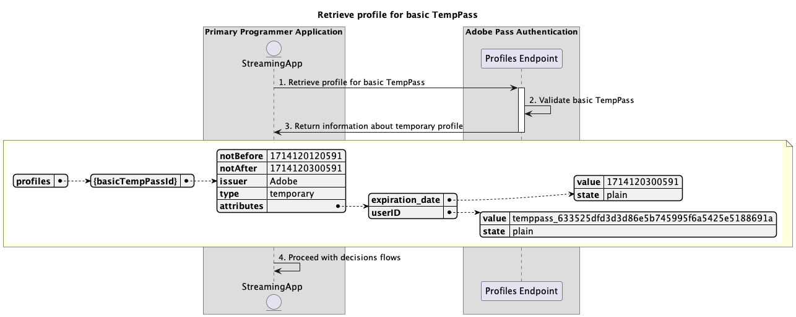
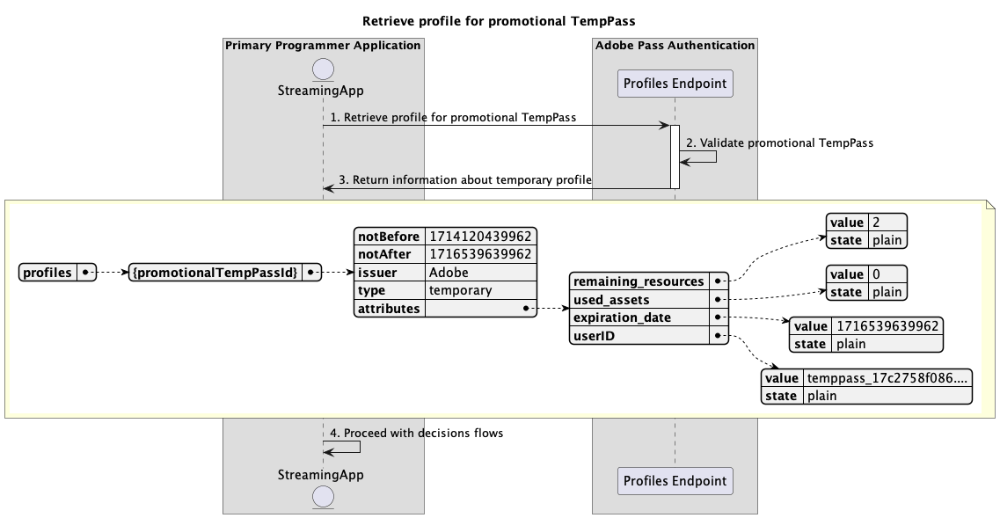

# Fluxos de acesso temporário {#temporary-access-flows}

>[!IMPORTANT]
>
> O conteúdo desta página é fornecido apenas para fins informativos. O uso desta API requer uma licença atual do Adobe. Não é permitida nenhuma utilização não autorizada.

>[!IMPORTANT]
>
> A implementação da REST API V2 é limitada pela documentação do [Mecanismo de limitação](/help/authentication/throttling-mechanism.md).

O TempPass permite que os programadores forneçam acesso temporário a seu conteúdo protegido sem solicitar que os usuários se autentiquem com uma conta MVPD válida.

Para obter mais detalhes sobre o recurso TempPass, consulte a documentação [TempPass](../../../temp-pass.md).

Os fluxos de acesso temporário permitem consultar os seguintes cenários:

* [Recuperar decisões de autorização usando TempPass básico](#retrieve-authorization-decisions-using-basic-temppass)
* [Recuperar decisões de autorização usando TempPass promocional](#retrieve-authorization-decisions-using-promotional-temppass)
* [Consumir o número máximo de recursos usando o TempPass promocional](#consume-maximum-number-of-resources-using-promotional-temppass)
* [Recuperar decisões de autorização quando o TempPass básico ou promocional expirar](#retrieve-authorization-decisions-when-basic-or-promotional-temppass-expires)
* [Recuperar perfil para TempPass básico](#retrieve-profile-for-basic-temppass)
* [Recuperar perfil para TempPass promocional](#retrieve-profile-for-promotional-temppass)

## Recuperar decisões de autorização usando TempPass básico {#retrieve-authorization-decisions-using-basic-temppass}

### Pré-requisitos {#prerequisites-retrieve-authorization-decisions-using-basic-temppass}

Antes de recuperar decisões de autorização usando o TempPass básico, verifique se os seguintes pré-requisitos foram atendidos:

* O aplicativo de transmissão deseja fornecer acesso temporário para reproduzir conteúdo sem solicitar que o usuário se autentique.
* O aplicativo de streaming deve recuperar uma decisão de autorização antes de reproduzir um recurso selecionado pelo usuário.

>[!IMPORTANT]
>
> Suposições
> 
>  
> 
> * Deve haver uma configuração válida do TempPass básico aplicada à integração entre o `serviceProvider` e o `mvpd` fornecidos.
> * O TTL (Tempo de vida útil) configurado para o TempPass básico não expirou.

### Fluxo de trabalho (WRK) {#workflow-retrieve-authorization-decisions-using-basic-temppass}

Siga as etapas fornecidas para implementar o fluxo de autorização usando o TempPass básico, conforme mostrado no diagrama a seguir.

*Recuperar decisões de autorização usando o TempPass básico*

1. **Recuperar decisão de autorização:** o aplicativo de streaming reúne todos os dados necessários para obter uma decisão de autorização para um recurso específico, chamando o ponto de extremidade de Autorização de Decisões.

   >[!IMPORTANT]
   >
   > Consulte a [Recuperar decisões de autorização usando a documentação da API do mvpd](../../apis/decisions-apis/rest-api-v2-decisions-apis-retrieve-authorization-decisions-using-specific-mvpd.md) específica para obter detalhes sobre:
   > 
   > * Todos os parâmetros _necessários_, como `serviceProvider`, `mvpd` e `resources`
   > * Todos os cabeçalhos _necessários_, como `Authorization` e `AP-Device-Identifier`
   > * Todos os _parâmetros e cabeçalhos_ opcionais

1. **Validar TempPass básico:** o servidor do Adobe Pass verifica se há uma configuração válida do TempPass básico aplicada à integração entre o `serviceProvider` e o `mvpd` fornecidos.

1. **Retornar a decisão `Permit` com o token de mídia:** A resposta do ponto de extremidade de Autorização de Decisões contém uma decisão `Permit` e um token de mídia.

   >[!IMPORTANT]
   >
   > Consulte a [Recuperar decisões de autorização usando a documentação específica da API mvpd](../../apis/decisions-apis/rest-api-v2-decisions-apis-retrieve-authorization-decisions-using-specific-mvpd.md) para obter detalhes sobre as informações fornecidas em uma resposta de decisão.
   >
   >  
   > 
   > O endpoint de autorização de decisões valida os dados da solicitação para garantir que as condições básicas sejam atendidas:
   >
   > * Os parâmetros e cabeçalhos _requeridos_ devem ser válidos.
   > * A integração entre o `serviceProvider` e o `mvpd` fornecidos deve estar ativa.
   >
   >  
   > 
   > Se a validação básica falhar, uma resposta de erro será gerada, fornecendo informações adicionais que seguem a [documentação de Códigos de erro aprimorados](../../../enhanced-error-codes.md).
   >
   >  
   > 
   > O endpoint de autorização de decisões usa os dados da solicitação para verificar se as condições de acesso temporárias são atendidas:
   >
   > * O TTL (Time-To-Live) configurado para o TempPass básico não deve expirar.
   >
   >  
   > 
   > Se a validação de acesso temporário falhar, uma resposta de erro será gerada, fornecendo informações adicionais que seguem a [documentação de Códigos de erro aprimorados](../../../enhanced-error-codes.md).

1. **Iniciar fluxo com token de mídia:** O aplicativo de streaming usa o token de mídia para reproduzir o conteúdo.

## Recuperar decisões de autorização usando TempPass promocional {#retrieve-authorization-decisions-using-promotional-temppass}

### Pré-requisitos {#prerequisites-retrieve-authorization-decisions-using-promotional-temppass}

Antes de recuperar decisões de autorização usando o TempPass promocional, verifique se os seguintes pré-requisitos foram atendidos:

* O aplicativo de transmissão deseja fornecer acesso temporário para reproduzir um número máximo de recursos sem solicitar a autenticação do usuário.
* O aplicativo de streaming deve incluir informações exclusivas sobre a identidade do usuário ao recuperar uma decisão de autorização.
* O aplicativo de streaming deve recuperar uma decisão de autorização antes de reproduzir um recurso selecionado pelo usuário.

>[!IMPORTANT]
>
> Suposições
>
>  
> 
> * Deve haver uma configuração válida de TempPass promocional aplicado à integração entre o `serviceProvider` e o `mvpd` fornecidos.
> * O TTL (Time-To-Live) configurado para o TempPass promocional não expirou.
> * O número máximo de recursos configurados para o TempPass promocional não foi consumido.

### Fluxo de trabalho (WRK) {#workflow-retrieve-authorization-decisions-using-promotional-temppass}

Siga as etapas fornecidas para implementar o fluxo de autorização usando o TempPass promocional, conforme mostrado no diagrama a seguir.

*Recuperar decisões de autorização usando o TempPass promocional*

1. **Recuperar decisão de autorização:** o aplicativo de streaming reúne todos os dados necessários para obter uma decisão de autorização para um recurso específico, chamando o ponto de extremidade de Autorização de Decisões.

   >[!IMPORTANT]
   >
   > Consulte a [Recuperar decisões de autorização usando a documentação da API do mvpd](../../apis/decisions-apis/rest-api-v2-decisions-apis-retrieve-authorization-decisions-using-specific-mvpd.md) específica para obter detalhes sobre:
   >
   > * Todos os parâmetros _necessários_, como `serviceProvider`, `mvpd` e `resources`
   > * Todos os cabeçalhos _necessários_, como `Authorization` e `AP-Device-Identifier`
   > * Todos os _parâmetros e cabeçalhos_ opcionais
   >
   >  
   >
   > O ponto de extremidade de Autorização de Decisões requer a presença do cabeçalho `AP-TempPass-Identity` ao usar TempPass promocional. O cabeçalho inclui informações exclusivas sobre a identidade do usuário que acessa o conteúdo.
   > 
   >  
   > 
   > Para obter mais detalhes sobre o cabeçalho `AP-TempPass-Identity`, consulte a documentação [AP-TempPass-Identity](../../appendix/headers/rest-api-v2-appendix-headers-ap-temppass-identity.md).

1. **Validar TempPass promocional:** o servidor Adobe Pass verifica se há uma configuração válida de TempPass promocional aplicada à integração entre o `serviceProvider` e o `mvpd` fornecidos.

1. **Retornar a decisão `Permit` com o token de mídia:** A resposta do ponto de extremidade de Autorização de Decisões contém uma decisão `Permit` e um token de mídia.

   >[!IMPORTANT]
   >
   > Consulte a [Recuperar decisões de autorização usando a documentação específica da API mvpd](../../apis/decisions-apis/rest-api-v2-decisions-apis-retrieve-authorization-decisions-using-specific-mvpd.md) para obter detalhes sobre as informações fornecidas em uma resposta de decisão.
   > 
   >  
   > 
   > O endpoint de autorização de decisões valida os dados da solicitação para garantir que as condições básicas sejam atendidas:
   >
   > * Os parâmetros e cabeçalhos _requeridos_ devem ser válidos.
   > * A integração entre o `serviceProvider` e o `mvpd` fornecidos deve estar ativa.
   >
   >  
   > 
   > Se a validação básica falhar, uma resposta de erro será gerada, fornecendo informações adicionais que seguem a [documentação de Códigos de erro aprimorados](../../../enhanced-error-codes.md).
   >
   >  
   > 
   > O endpoint de autorização de decisões usa os dados da solicitação para verificar se as condições de acesso temporárias são atendidas:
   >
   > * O TTL (Time-To-Live) configurado para o TempPass promocional não deve expirar.
   > * O número máximo de recursos configurados para o TempPass promocional não deve ser consumido.
   >
   >  
   > 
   > Se a validação de acesso temporário falhar, uma resposta de erro será gerada, fornecendo informações adicionais que seguem a [documentação de Códigos de erro aprimorados](../../../enhanced-error-codes.md).

1. **Iniciar fluxo com token de mídia:** O aplicativo de streaming usa o token de mídia para reproduzir o conteúdo.

## Consumir o número máximo de recursos usando o TempPass promocional {#consume-maximum-number-of-resources-using-promotional-temppass}

### Pré-requisitos {#prerequisites-consume-maximum-number-of-resources-using-promotional-temppass}

Antes de consumir um número máximo de recursos usando o TempPass promocional, verifique se os seguintes pré-requisitos foram atendidos:

* O aplicativo de transmissão deseja fornecer acesso temporário para reproduzir um número máximo de recursos sem solicitar a autenticação do usuário.
* O aplicativo de streaming deve incluir informações exclusivas sobre a identidade do usuário ao recuperar uma decisão de autorização.
* O aplicativo de streaming deve recuperar uma decisão de autorização antes de reproduzir um recurso selecionado pelo usuário.

>[!IMPORTANT]
>
> Suposições
>
>  
> 
> * Deve haver uma configuração válida de TempPass promocional aplicado à integração entre o `serviceProvider` e o `mvpd` fornecidos.
> * O TTL (Time-To-Live) configurado para o TempPass promocional não expirou.
> * O número máximo de recursos configurados para o TempPass promocional é 1.

### Fluxo de trabalho (WRK) {#workflow-consume-maximum-number-of-resources-using-promotional-temppass}

Siga as etapas fornecidas para implementar o fluxo de autorização ao consumir um número máximo de recursos usando o TempPass promocional, conforme mostrado no diagrama a seguir.

*Consumir o número máximo de recursos usando o TempPass promocional*

1. **Recuperar perfil para TempPass promocional:** O aplicativo de streaming reúne todos os dados necessários para recuperar informações de perfil para TempPass promocional, enviando uma solicitação para o ponto de extremidade de Perfis.

   >[!IMPORTANT]
   >
   > Consulte a [Recuperar perfil para a documentação específica da API mvpd](../../apis/profiles-apis/rest-api-v2-profiles-apis-retrieve-profile-for-specific-mvpd.md) para obter detalhes sobre:
   >
   > * Todos os parâmetros _necessários_, como `serviceProvider` e `mvpd`
   > * Todos os cabeçalhos _necessários_, como `Authorization` e `AP-Device-Identifier`
   > * Todos os _parâmetros e cabeçalhos_ opcionais
   >
   >  
   > 
   > A consulta de endpoint de Perfis é opcional e pode ser usada para determinar quantos recursos ainda podem ser reproduzidos usando o TempPass promocional.

1. **Validar TempPass promocional:** o servidor Adobe Pass verifica se há uma configuração válida de TempPass promocional aplicada à integração entre o `serviceProvider` e o `mvpd` fornecidos.

1. **Retornar informações sobre o perfil temporário:** A resposta do ponto de extremidade Profiles contém informações sobre o perfil temporário, incluindo o atributo `type` definido como &quot;temporário&quot;.

   >[!IMPORTANT]
   >
   > Consulte a [Recuperar perfil para a documentação específica da API do mvpd](../../apis/profiles-apis/rest-api-v2-profiles-apis-retrieve-profile-for-specific-mvpd.md) para obter detalhes sobre as informações fornecidas na resposta do perfil.
   > 
   >  
   > 
   > O endpoint de Perfis valida os dados da solicitação para garantir que as condições básicas sejam atendidas:
   >
   > * Os parâmetros e cabeçalhos _requeridos_ devem ser válidos.
   > * A integração entre o `serviceProvider` e o `mvpd` fornecidos deve estar ativa.
   > 
   >  
   >
   > Se a validação básica falhar, uma resposta de erro será gerada, fornecendo informações adicionais que seguem a [documentação de Códigos de erro aprimorados](../../../enhanced-error-codes.md).
   >
   >  
   > 
   > O endpoint de Perfis usa os dados da solicitação para verificar se as condições de acesso temporárias são atendidas:
   >
   > * O TTL (Time-To-Live) configurado para o TempPass promocional não deve expirar.
   > * O número máximo de recursos configurados para o TempPass promocional não deve ser consumido.
   >
   >  
   > 
   > Se a validação de acesso temporário falhar, uma resposta de erro será gerada, fornecendo informações adicionais que seguem a [documentação de Códigos de erro aprimorados](../../../enhanced-error-codes.md).

1. **Continuar com fluxos de decisões:** Se a resposta do ponto de extremidade Perfis contiver um perfil, o aplicativo de streaming usará as informações de perfil temporárias para continuar com os fluxos de decisões subsequentes.

1. **Recuperar decisão de autorização:** o aplicativo de streaming reúne todos os dados necessários para obter uma decisão de autorização para um recurso específico, chamando o ponto de extremidade de Autorização de Decisões.

   >[!IMPORTANT]
   > 
   > Consulte a [Recuperar decisões de autorização usando a documentação da API do mvpd](../../apis/decisions-apis/rest-api-v2-decisions-apis-retrieve-authorization-decisions-using-specific-mvpd.md) específica para obter detalhes sobre:
   >
   > * Todos os parâmetros _necessários_, como `serviceProvider`, `mvpd` e `resources`
   > * Todos os cabeçalhos _necessários_, como `Authorization` e `AP-Device-Identifier`
   > * Todos os _parâmetros e cabeçalhos_ opcionais
   >
   >  
   > 
   > O ponto de extremidade de Autorização de Decisões requer a presença do cabeçalho `AP-TempPass-Identity` ao usar TempPass promocional. O cabeçalho inclui informações exclusivas sobre a identidade do usuário que acessa o conteúdo.
   > 
   >  
   > 
   > Para obter mais detalhes sobre o cabeçalho `AP-TempPass-Identity`, consulte a documentação [AP-TempPass-Identity](../../appendix/headers/rest-api-v2-appendix-headers-ap-temppass-identity.md).

1. **Validar TempPass promocional:** o servidor Adobe Pass verifica se há uma configuração válida de TempPass promocional aplicada à integração entre o `serviceProvider` e o `mvpd` fornecidos.

1. **Retornar a decisão `Permit` com o token de mídia:** A resposta do ponto de extremidade de Autorização de Decisões contém uma decisão `Permit` e um token de mídia.

   >[!IMPORTANT]
   >
   > Consulte a [Recuperar decisões de autorização usando a documentação específica da API mvpd](../../apis/decisions-apis/rest-api-v2-decisions-apis-retrieve-authorization-decisions-using-specific-mvpd.md) para obter detalhes sobre as informações fornecidas em uma resposta de decisão.
   > 
   >  
   > 
   > O endpoint de autorização de decisões valida os dados da solicitação para garantir que as condições básicas sejam atendidas:
   >
   > * Os parâmetros e cabeçalhos _requeridos_ devem ser válidos.
   > * A integração entre o `serviceProvider` e o `mvpd` fornecidos deve estar ativa.
   >
   >  
   > 
   > Se a validação básica falhar, uma resposta de erro será gerada, fornecendo informações adicionais que seguem a [documentação de Códigos de erro aprimorados](../../../enhanced-error-codes.md).
   > 
   >  
   > 
   > O endpoint de autorização de decisões usa os dados da solicitação para verificar se as condições de acesso temporárias são atendidas:
   >
   > * O TTL (Time-To-Live) configurado para o TempPass promocional não deve expirar.
   > * O número máximo de recursos configurados para o TempPass promocional não deve ser consumido.
   >
   >  
   > 
   > Se a validação de acesso temporário falhar, uma resposta de erro será gerada, fornecendo informações adicionais que seguem a [documentação de Códigos de erro aprimorados](../../../enhanced-error-codes.md).

1. **Recuperar decisão de autorização:** o aplicativo de streaming reúne todos os dados necessários para obter uma decisão de autorização para um recurso específico, chamando o ponto de extremidade de Autorização de Decisões.

   >[!IMPORTANT]
   >
   > Consulte a [Recuperar decisões de autorização usando a documentação da API do mvpd](../../apis/decisions-apis/rest-api-v2-decisions-apis-retrieve-authorization-decisions-using-specific-mvpd.md) específica para obter detalhes sobre:
   >
   > * Todos os parâmetros _necessários_, como `serviceProvider`, `mvpd` e `resources`
   > * Todos os cabeçalhos _necessários_, como `Authorization` e `AP-Device-Identifier`
   > * Todos os _parâmetros e cabeçalhos_ opcionais
   >
   >  
   > 
   > O ponto de extremidade de Autorização de Decisões requer a presença do cabeçalho `AP-TempPass-Identity` ao usar TempPass promocional. O cabeçalho inclui informações exclusivas sobre a identidade do usuário que acessa o conteúdo.
   >
   >  
   > 
   > Para obter mais detalhes sobre o cabeçalho `AP-TempPass-Identity`, consulte a documentação [AP-TempPass-Identity](../../appendix/headers/rest-api-v2-appendix-headers-ap-temppass-identity.md).

1. **Validar TempPass promocional:** o servidor Adobe Pass verifica se há uma configuração válida de TempPass promocional aplicada à integração entre o `serviceProvider` e o `mvpd` fornecidos.

1. **Retornar a decisão `Deny` com detalhes:** A resposta do ponto de extremidade de Autorização de Decisões contém uma decisão `Deny` e uma carga de erro que segue a documentação de [Códigos de Erro Aprimorados](../../../enhanced-error-codes.md).

   >[!IMPORTANT]
   >
   > Consulte a [Recuperar decisões de autorização usando a documentação específica da API mvpd](../../apis/decisions-apis/rest-api-v2-decisions-apis-retrieve-authorization-decisions-using-specific-mvpd.md) para obter detalhes sobre as informações fornecidas em uma resposta de decisão.
   > 
   >  
   > 
   > O endpoint de autorização de decisões valida os dados da solicitação para garantir que as condições básicas sejam atendidas:
   >
   > * Os parâmetros e cabeçalhos _requeridos_ devem ser válidos.
   > * A integração entre o `serviceProvider` e o `mvpd` fornecidos deve estar ativa.
   >
   >  
   > 
   > Se a validação básica falhar, uma resposta de erro será gerada, fornecendo informações adicionais que seguem a [documentação de Códigos de erro aprimorados](../../../enhanced-error-codes.md).
   >
   >  
   > 
   > O endpoint de autorização de decisões usa os dados da solicitação para verificar se as condições de acesso temporárias são atendidas:
   >
   > * O TTL (Time-To-Live) configurado para o TempPass promocional não deve expirar.
   > * O número máximo de recursos configurados para o TempPass promocional não deve ser consumido.
   >
   >  
   > 
   > Se a validação de acesso temporário falhar, uma resposta de erro será gerada, fornecendo informações adicionais que seguem a [documentação de Códigos de erro aprimorados](../../../enhanced-error-codes.md).

1. **Identificador de detalhes de decisão `Deny`:** o aplicativo de streaming processa as informações de erro da resposta e pode usá-las para exibir opcionalmente uma mensagem específica na interface do usuário.

   >[!TIP]
   >
   > Sugestão: O aplicativo de transmissão pode informar aos usuários que o número máximo de recursos foi excedido e aconselhá-los a iniciar um fluxo de autenticação básico usando um MVPD regular para continuar assistindo.

## Recuperar decisões de autorização quando o TempPass básico ou promocional expirar {#retrieve-authorization-decisions-when-basic-or-promotional-temppass-expires}

### Pré-requisitos {#prerequisites-retrieve-authorization-decisions-when-basic-or-promotional-temppass-expires}

Antes de recuperar decisões de autorização quando o TempPass básico ou promocional expirar, verifique se os seguintes pré-requisitos foram atendidos:

* [Pré-requisitos antes de recuperar decisões de autorização usando o TempPass básico](#prerequisites-retrieve-authorization-decisions-using-basic-temppass).
* [Pré-requisitos antes de recuperar decisões de autorização usando TempPass promocional](#prerequisites-retrieve-authorization-decisions-using-promotional-temppass).

>[!IMPORTANT]
>
> Suposições
> 
>  
> 
> * Deve haver uma configuração válida de TempPass básico ou promocional aplicado à integração entre o `serviceProvider` e o `mvpd` fornecidos.
> * O TTL (Time-To-Live) configurado para o básico ou promocional O limite de duração do acesso temporário foi excedido.

### Fluxo de trabalho (WRK) {#workflow-retrieve-authorization-decisions-when-basic-or-promotional-temppass-expires}

Siga as etapas fornecidas para implementar o fluxo de autorização quando o TempPass básico ou promocional expirar, conforme mostrado no diagrama a seguir.

*Recuperar decisões de autorização quando o TempPass básico ou promocional expirar*

1. **Recuperar decisão de autorização:** o aplicativo de streaming reúne todos os dados necessários para obter uma decisão de autorização para um recurso específico, chamando o ponto de extremidade de Autorização de Decisões.

   >[!IMPORTANT]
   >
   > Consulte a [Recuperar decisões de autorização usando a documentação da API do mvpd](../../apis/decisions-apis/rest-api-v2-decisions-apis-retrieve-authorization-decisions-using-specific-mvpd.md) específica para obter detalhes sobre:
   > 
   > * Todos os parâmetros _necessários_, como `serviceProvider`, `mvpd` e `resources`
   > * Todos os cabeçalhos _necessários_, como `Authorization` e `AP-Device-Identifier`
   > * Todos os _parâmetros e cabeçalhos_ opcionais
   >
   >  
   > 
   > O ponto de extremidade de Autorização de Decisões requer a presença do cabeçalho `AP-TempPass-Identity` ao usar TempPass promocional. O cabeçalho inclui informações exclusivas sobre a identidade do usuário que acessa o conteúdo.
   > 
   >  
   > 
   > Para obter mais detalhes sobre o cabeçalho `AP-TempPass-Identity`, consulte a documentação [AP-TempPass-Identity](../../appendix/headers/rest-api-v2-appendix-headers-ap-temppass-identity.md).

1. **Validar TempPass básico ou promocional:** o servidor do Adobe Pass verifica se há uma configuração válida de TempPass básico ou promocional aplicada à integração entre o `serviceProvider` fornecido e o `mvpd`.

1. **Retornar a decisão `Deny` com detalhes:** A resposta do ponto de extremidade de Autorização de Decisões contém uma decisão `Deny` e uma carga de erro que segue a documentação de [Códigos de Erro Aprimorados](../../../enhanced-error-codes.md).

   >[!IMPORTANT]
   >
   > Consulte a [Recuperar decisões de autorização usando a documentação específica da API mvpd](../../apis/decisions-apis/rest-api-v2-decisions-apis-retrieve-authorization-decisions-using-specific-mvpd.md) para obter detalhes sobre as informações fornecidas em uma resposta de decisão.
   > 
   >  
   > 
   > O endpoint de autorização de decisões valida os dados da solicitação para garantir que as condições básicas sejam atendidas:
   >
   > * Os parâmetros e cabeçalhos _requeridos_ devem ser válidos.
   > * A integração entre o `serviceProvider` e o `mvpd` fornecidos deve estar ativa.
   >
   >  
   > 
   > Se a validação básica falhar, uma resposta de erro será gerada, fornecendo informações adicionais que seguem a [documentação de Códigos de erro aprimorados](../../../enhanced-error-codes.md).
   >
   >  
   > 
   > O endpoint de autorização de decisões usa os dados da solicitação para verificar se as condições de acesso temporárias são atendidas:
   >
   > * O TTL (Time-To-Live) configurado para o TempPass básico ou promocional não deve expirar.
   > * O número máximo de recursos configurados para o TempPass promocional não deve ser consumido.
   >
   >  
   > 
   > Se a validação de acesso temporário falhar, uma resposta de erro será gerada, fornecendo informações adicionais que seguem a [documentação de Códigos de erro aprimorados](../../../enhanced-error-codes.md).

1. **Identificador de detalhes de decisão `Deny`:** o aplicativo de streaming processa as informações de erro da resposta e pode usá-las para exibir opcionalmente uma mensagem específica na interface do usuário.

   >[!TIP]
   >
   > Sugestão: O aplicativo de transmissão pode informar aos usuários que o acesso temporário expirou e aconselhá-los a iniciar um fluxo de autenticação básico usando um MVPD regular para continuar assistindo.

## Recuperar perfil para TempPass básico {#retrieve-profile-for-basic-temppass}

>[!IMPORTANT]
>
> A consulta de endpoint de Perfis é opcional para TempPass básico.

### Pré-requisitos {#prerequisites-retrieve-profile-for-basic-temppass}

Antes de recuperar o perfil para TempPass básico, verifique se os seguintes pré-requisitos foram atendidos:

* O aplicativo de streaming deseja recuperar o perfil temporário para garantir que o acesso temporário não tenha expirado.

>[!IMPORTANT]
>
> Suposições
> 
>  
> 
> * Deve haver uma configuração válida do TempPass básico aplicada à integração entre o `serviceProvider` e o `mvpd` fornecidos.
> * O TTL (Time-To-Live) configurado para o TempPass básico não deve expirar.

### Fluxo de trabalho (WRK) {#workflow-retrieve-profile-information-for-basic-temppass}

Siga as etapas fornecidas para implementar o fluxo de recuperação de perfil para TempPass básico, conforme mostrado no diagrama a seguir.

*Recuperar perfil para TempPass básico*

1. **Recuperar perfil para TempPass básico:** O aplicativo de streaming reúne todos os dados necessários para recuperar informações de perfil para TempPass básico, enviando uma solicitação para o ponto de extremidade de Perfis.

   >[!IMPORTANT]
   >
   > Consulte a [Recuperar perfil para a documentação específica da API mvpd](../../apis/profiles-apis/rest-api-v2-profiles-apis-retrieve-profile-for-specific-mvpd.md) para obter detalhes sobre:
   > 
   > * Todos os parâmetros _necessários_, como `serviceProvider` e `mvpd`
   > * Todos os cabeçalhos _necessários_, como `Authorization` e `AP-Device-Identifier`
   > * Todos os _parâmetros e cabeçalhos_ opcionais

1. **Validar TempPass básico:** o servidor do Adobe Pass verifica se há uma configuração válida do TempPass básico aplicada à integração entre o `serviceProvider` e o `mvpd` fornecidos.

1. **Retornar informações sobre o perfil temporário:** A resposta do ponto de extremidade Profiles contém informações sobre o perfil temporário, incluindo o atributo `type` definido como &quot;temporário&quot;.

   >[!IMPORTANT]
   >
   > Consulte a [Recuperar perfil para a documentação específica da API do mvpd](../../apis/profiles-apis/rest-api-v2-profiles-apis-retrieve-profile-for-specific-mvpd.md) para obter detalhes sobre as informações fornecidas na resposta do perfil.
   > 
   >  
   > 
   > O endpoint de Perfis valida os dados da solicitação para garantir que as condições básicas sejam atendidas:
   >
   > * Os parâmetros e cabeçalhos _requeridos_ devem ser válidos.
   > * A integração entre o `serviceProvider` e o `mvpd` fornecidos deve estar ativa.
   >
   >  
   > 
   > Se a validação básica falhar, uma resposta de erro será gerada, fornecendo informações adicionais que seguem a [documentação de Códigos de erro aprimorados](../../../enhanced-error-codes.md).
   >
   >  
   > 
   > O endpoint de Perfis usa os dados da solicitação para verificar se as condições de acesso temporárias são atendidas:
   >
   > * O TTL (Time-To-Live) configurado para o TempPass básico não deve expirar.
   >
   >  
   > 
   > Se a validação de acesso temporário falhar, uma resposta de erro será gerada, fornecendo informações adicionais que seguem a [documentação de Códigos de erro aprimorados](../../../enhanced-error-codes.md).

1. **Continuar com fluxos de decisões:** Se a resposta do ponto de extremidade Perfis contiver um perfil, o aplicativo de streaming usará as informações de perfil temporárias para continuar com os fluxos de decisões subsequentes.

## Recuperar perfil para TempPass promocional {#retrieve-profile-for-promotional-temppass}

>[!IMPORTANT]
>
> A consulta de endpoint de Perfis é opcional para TempPass promocional.

### Pré-requisitos {#prerequisites-retrieve-profile-for-promotional-temppass}

Antes de recuperar o perfil para TempPass promocional, verifique se os seguintes pré-requisitos foram atendidos:

* O aplicativo de transmissão deseja recuperar o perfil temporário para garantir que o acesso temporário não tenha expirado ou para determinar quantos recursos ainda podem ser reproduzidos.

>[!IMPORTANT]
>
> Suposições
>
>  
> 
> * Deve haver uma configuração válida de TempPass promocional aplicado à integração entre o `serviceProvider` e o `mvpd` fornecidos.
> * O TTL (Time-To-Live) configurado para o TempPass promocional não expirou.
> * O número máximo de recursos configurados para o TempPass promocional não foi consumido.

### Fluxo de trabalho (WRK) {#workflow-retrieve-profile-information-for-promotional-temppass}

Siga as etapas fornecidas para implementar o fluxo de recuperação de perfil para TempPass promocional, conforme mostrado no diagrama a seguir.

*Recuperar perfil para TempPass promocional*

1. **Recuperar perfil para TempPass promocional:** O aplicativo de streaming reúne todos os dados necessários para recuperar informações de perfil para TempPass promocional, enviando uma solicitação para o ponto de extremidade de Perfis.

   >[!IMPORTANT]
   >
   > Consulte a [Recuperar perfil para a documentação específica da API mvpd](../../apis/profiles-apis/rest-api-v2-profiles-apis-retrieve-profile-for-specific-mvpd.md) para obter detalhes sobre:
   > 
   > * Todos os parâmetros _necessários_, como `serviceProvider` e `mvpd`
   > * Todos os cabeçalhos _necessários_, como `Authorization` e `AP-Device-Identifier`
   > * Todos os _parâmetros e cabeçalhos_ opcionais

1. **Validar TempPass promocional:** o servidor Adobe Pass verifica se há uma configuração válida de TempPass promocional aplicada à integração entre o `serviceProvider` e o `mvpd` fornecidos.

1. **Retornar informações sobre o perfil temporário:** A resposta do ponto de extremidade Profiles contém informações sobre o perfil temporário, incluindo o atributo `type` definido como &quot;temporário&quot;.

   >[!IMPORTANT]
   >
   > Consulte a [Recuperar perfil para a documentação específica da API do mvpd](../../apis/profiles-apis/rest-api-v2-profiles-apis-retrieve-profile-for-specific-mvpd.md) para obter detalhes sobre as informações fornecidas na resposta do perfil.
   > 
   >  
   > 
   > O endpoint de Perfis valida os dados da solicitação para garantir que as condições básicas sejam atendidas:
   >
   > * Os parâmetros e cabeçalhos _requeridos_ devem ser válidos.
   > * A integração entre o `serviceProvider` e o `mvpd` fornecidos deve estar ativa.
   >
   >  
   > 
   > Se a validação básica falhar, uma resposta de erro será gerada, fornecendo informações adicionais que seguem a [documentação de Códigos de erro aprimorados](../../../enhanced-error-codes.md).
   >
   >  
   > 
   > O endpoint de Perfis usa os dados da solicitação para verificar se as condições de acesso temporárias são atendidas:
   >
   > * O TTL (Time-To-Live) configurado para o TempPass promocional não deve expirar.
   > * O número máximo de recursos configurados para o TempPass promocional não deve ser consumido.
   >
   >  
   > 
   > Se a validação de acesso temporário falhar, uma resposta de erro será gerada, fornecendo informações adicionais que seguem a [documentação de Códigos de erro aprimorados](../../../enhanced-error-codes.md).

1. **Continuar com fluxos de decisões:** Se a resposta do ponto de extremidade Perfis contiver um perfil, o aplicativo de streaming usará as informações de perfil temporárias para continuar com os fluxos de decisões subsequentes.
