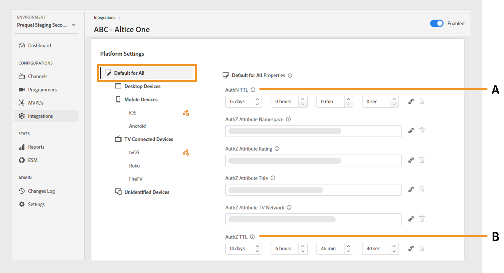

# Integrações

>[!NOTE]
>
>O conteúdo desta página é fornecido apenas para fins informativos. O uso dessa API exige uma licença atual do Adobe. Não é permitida nenhuma utilização não autorizada.

A variável **Integrações** do Painel TVE permite visualizar e gerenciar configurações para as integrações entre seus canais e MVPDs. Também é possível [criar uma nova integração](#create-new-integration) de acordo com sua necessidade.

A variável **Integrações** no painel esquerdo exibe uma lista de integrações existentes com os seguintes detalhes:

* Status que indica se a integração está ativa ou inativa no momento
* Integração que vincula canais específicos aos respectivos MVPDs
* Nome do canal com ID de canal
* Nome para exibição do MVPD e ID do MVPD

*Lista de integrações existentes*

Digite o nome do canal ou MVPD no campo **Pesquisar** acima da lista para saber mais sobre a integração.

## Gerenciar configurações de integração {#manage-integration-conf}

Siga estas etapas para gerenciar uma integração específica.

1. Selecione o **Integrações** no painel esquerdo.
1. Selecione uma integração na lista fornecida para exibir e editar várias configurações nas seguintes seções:

   * [Seleção de endpoint](#endpoint-selection)
   * [Configurações da plataforma](#platform-settings)
   * [Metadados do usuário](#user-metadata)

>[!IMPORTANT]
>
> Exibir [Revisar e enviar alterações](/help/authentication/tve-dashboard-review-push-changes.md) para obter mais informações sobre como ativar as alterações de configuração.

### Seleção de ponto de extremidade {#endpoint-selection}

Esta seção permite escolher os endpoints do MVPD usados para fluxos de autenticação, autorização e logout nos respectivos menus suspensos.

*Endpoints para fluxos de autenticação, autorização e logout*

>[!NOTE]
>
>Os MVPDs podem fornecer um ou vários endpoints para cada fluxo. Ao integrar um novo canal, o MVPD deve especificar seu endpoint preferencial para cada fluxo.

>[!IMPORTANT]
>
>Qualquer alteração nos endpoints afetará o comportamento geral de uma integração. Essas alterações só devem ser implementadas após receber a confirmação do MVPD.

### Configurações da plataforma {#platform-settings}

Esta seção permite visualizar e editar configurações de integração em todas as [plataformas](/help/authentication/tve-dashboard-reports.md#platforms). Você pode alterar essas configurações com base em plataformas individuais. Por exemplo, é possível ajustar a duração do TTL de autorização no Android, mantendo um valor padrão para outra plataforma.

Cada propriedade nas configurações da plataforma herda um valor padrão definido pelo MVPD, mas pode ser ajustado se necessário.

>[!IMPORTANT]
>
>Um acordo com o MVPD é necessário para determinar valores definidos para cada propriedade nas configurações da plataforma.

>[!IMPORTANT]
>
> A herança de configurações segue uma cadeia que começa nas configurações do MVPD (que são as mais gerais), depois o endpoint do MVPD, a integração, a categoria da plataforma e a plataforma (que contém o valor mais específico).

**Configurações da plataforma** é usado para substituir configurações para cada nível na cadeia de herança. Os níveis disponíveis na cadeia são agrupados da seguinte maneira:

* **Padrão para todos**: Defina valores para propriedades aplicáveis universalmente em todas as plataformas se os valores específicos da plataforma não estiverem definidos, independentemente das implementações do Programador.

* **Dispositivos desktop**: defina valores para propriedades aplicáveis a todos os desktops e notebooks, independentemente do método de programação (SDK JS ou API REST).

* **Dispositivos móveis**: defina valores para propriedades aplicáveis a todos os dispositivos móveis, incluindo **iOS**, **Android** e outros, independentemente da abordagem de programação (SDK ou REST API).

* **Dispositivos conectados à TV**: Defina valores para as propriedades aplicáveis a todos os dispositivos conectados à TV, incluindo **tvOS**, **Roku**, **FireTV**, e outros, independentemente do método de programação (SDK ou REST API).

* **Dispositivos não identificados**: Defina valores para propriedades aplicáveis a todos os dispositivos nos quais o mecanismo atual não pode identificar com precisão a plataforma. Nesses casos, aplique as regras mais restritivas definidas pelo MVPD.

  

  *Categoria de plataformas e seus dispositivos*

Selecionar  ícone localizado à direita de cada propriedade para explorar as propriedades usadas para cada nível de herança descrito acima.

#### Fluxos de negócios mais usados {#most-used-flows}

A variável **Configurações da plataforma** oferece uma variedade de propriedades usadas em diferentes fluxos comerciais. As propriedades reais podem variar dependendo dos MVPDs selecionados na integração específica. Abaixo estão os fluxos mais usados:

**AuthN TTL e AuthZ TTL em todas as plataformas**

>[!IMPORTANT]
>
>Os valores TTL de Autenticação (AuthN) e Autorização (AuthZ) devem estar consistentemente alinhados com as configurações MVPD.

Siga estas etapas para alterar a autenticação e a autorização TTL em todas as plataformas para uma integração específica.

1. Selecione o **Integrações** no painel esquerdo.
1. Selecione a integração cujos valores TTL de AuthN e TTL de AuthZ você deseja alterar.
1. Navegue até a **Configurações da plataforma** seção.

1. Selecionar **Padrão para todos** em **Configurações da plataforma**.

   >[!NOTE]
   >
   >Se você quiser alterar a duração de **TTL AuthN** e **TTL AuthZ** para uma categoria de plataforma ou uma plataforma específica, selecione a plataforma de acordo.

   

   *Alterar a duração do TTL AuthN TTL AuthZ em todas as plataformas*

   **A.** Propriedade AuthN TTL **B.** Propriedade TTL AuthZ

1. Selecione as setas para cima e para baixo para ajustar a duração do número de dias, horas, minutos e segundos na **TTL AuthN** e **TTL AuthZ** propriedades.

A duração de **TTL AuthN** e **TTL AuthZ** em todas as plataformas serão atualizadas somente após [revisar e enviar alterações](/help/authentication/tve-dashboard-review-push-changes.md).

**Habilitar SSO de plataforma**

>[!IMPORTANT]
>
>**Habilitar Logon Único** a propriedade é exclusivamente suportada em *iOS, tvOS, Roku e FireTV* plataformas. Ela só é aplicável a integrações com MVPDs que oferecem suporte a logon único para essas plataformas.

Siga estas etapas para ativar ou desativar o SSO para uma integração e plataforma específicas.

1. Selecione o **Integrações** no painel esquerdo.
1. Selecione a integração para a qual deseja ativar ou desativar o logon único.

1. Navegue até a **Configurações da plataforma** seção.

1. Selecione uma plataforma específica ou categoria de plataformas para as quais você deseja habilitar o logon único em **Configurações da plataforma**.

   

   *Habilitar Logon único para uma plataforma específica*

   **A.** Propriedade de logon único **B.** Impor propriedade de permissões da plataforma

1. Selecionar **Sim** para ativar ou **Não** para desativar do **Habilitar Logon Único** menu suspenso.

1. Selecionar **Sim** para ativar ou **Não** para desativar do **Forçar a permissão da plataforma** menu suspenso.

   **Forçar a permissão da plataforma** propriedade controla se a decisão do usuário de **Permitir** ou **Negar** o acesso à plataforma à sua assinatura do Provedor de TV é respeitado.

   Por exemplo, se ambas as opções **Habilitar Logon Único** e **Forçar a permissão da plataforma** estiverem ativados e o usuário optar por negar acesso à plataforma para sua assinatura do Provedor de TV. Em seguida, o respectivo aplicativo (canal) não poderá usar o token de autenticação da Adobe Pass obtido por outro aplicativo (canal).

A variável **Logon único** propriedade para uma plataforma selecionada será ativada ou desativada somente após [revisar e enviar alterações](/help/authentication/tve-dashboard-review-push-changes.md).

**Habilitar autenticação baseada em casa**

Siga estas etapas para habilitar ou desabilitar a autenticação baseada em página inicial para MVPDs baseados em OAuth2.

1. Selecione o **Integrações** no painel esquerdo.
1. Selecione a integração para a qual deseja ativar ou desativar a autenticação baseada em página inicial.
1. Navegue até a **Configurações da plataforma** seção.
1. Selecione uma plataforma específica ou categoria de plataformas para as quais deseja habilitar a autenticação baseada em página inicial em **Configurações da plataforma**.

   

   *Ativar autenticação baseada em casa para uma plataforma específica*

   **A.** Tentativa de propriedade HBA **B.** Propriedade HBA AuthN TTL

1. Selecionar **Sim** para habilitar e **Não** para desativar do **Tentativa de HBA** menu suspenso.

>[!IMPORTANT]
>
>Alteração da duração de **TTL AuthN HBA** propriedade deve ser evitada. Pode resultar em falhas inesperadas no processo de autorização.

A variável **Tentativa de HBA** para um MVPD específico será ativada ou desativada somente após [revisar e enviar alterações](/help/authentication/tve-dashboard-review-push-changes.md).

#### Adicionar mais propriedades {#add-more-properties}

A variável **Adicionar mais propriedades** O permite a flexibilidade para incluir propriedades específicas adicionais para integrações, especialmente para fluxos menos comuns.

É possível adicionar estas propriedades:

* Para todas as plataformas, selecione **Padrão para todos** à esquerda.
* Para uma categoria de plataforma, selecione **Dispositivos desktop**, **Dispositivos móveis** ou **Dispositivos conectados à TV** à esquerda.
* Para um dispositivo específico, selecione **iOS**, **Android**, **tvOS**, **Roku** ou **FireTV** à esquerda.

Estes são alguns exemplos de fluxos diferentes que podem ser ativados ao adicionar essas propriedades:

**Alterar o número de recursos pré-autorizados**

A maioria dos MVPDs oferece suporte a uma chamada authZ de comprovação usando até 5 IDs de recursos por padrão.
No entanto, nos casos em que os MVPDs concordam em aumentar esse limite, você pode navegar até o **Adicionar mais propriedades** e selecione **Comprovação de recursos máximos** no menu opções.

**Comprovação de recursos máximos** adicionará um novo atributo onde o limite acordado com o MVPD pode ser especificado.

*Adicionar a propriedade Recursos máximos de comprovação*

A variável **Comprovação de recursos máximos** A propriedade será adicionada somente após [revisar e enviar alterações](/help/authentication/tve-dashboard-review-push-changes.md).

**Alterar URL do logotipo ou nome de exibição do MVPD**

Para aplicativos de programador que não desejam criar o seletor de MVPD e dependem das configurações fornecidas, você pode navegar até o **Adicionar mais propriedades** e selecione **Nome de exibição** ou **URL do logotipo** para adicionar os URLs de nome para exibição ou logotipo necessários para cada MVPD no menu opções.

Valores diferentes para essas propriedades podem ser usados para o mesmo MVPD, dependendo da plataforma do dispositivo e da experiência do usuário desejada.

*Adicionar a propriedade Nome de exibição ou URL do logotipo*

A variável **Nome de exibição** ou **URL do logotipo** A propriedade será adicionada somente após [revisar e enviar alterações](/help/authentication/tve-dashboard-review-push-changes.md).

**Solicitar um novo fluxo de autenticação ao alternar o aplicativo (canal)**

Se você quiser forçar uma nova autenticação quando os usuários alternarem entre aplicativos. Nesse caso, você pode navegar para a variável **Adicionar mais propriedades**, selecione o **Autenticação por Agregador** propriedade.

Adicionando **Autenticação por Agregador** interrompe efetivamente o logon único para o respectivo canal.

*Adicionar propriedade Auth Per Aggregator*

A variável **Autenticação por Agregador** A propriedade será adicionada somente após [revisar e enviar alterações](/help/authentication/tve-dashboard-review-push-changes.md).

Depois de adicionado, selecione **Sim** para habilitar **Autenticação por Agregador** propriedade para uma integração selecionada.

#### Excluir propriedades {#delete-properties}

Selecionar  ícone localizado à direita de cada propriedade para excluir as propriedades que não são mais necessárias.

>[!NOTE]
>
>Determinadas propriedades não podem ser removidas, pois são requisitos obrigatórios para o MVPD selecionado.

A propriedade será excluída da variável **Configurações da plataforma** seção somente depois de [revisar e enviar alterações](/help/authentication/tve-dashboard-review-push-changes.md).

### Metadados do usuário {#user-metadata}

Esta seção permite atualizar as configurações para cada parâmetro de metadados do usuário compartilhado pelo MVPD.

>[!NOTE]
>
>Cada MVPD pode compartilhar diferentes parâmetros. Para obter mais informações sobre os parâmetros que um MVPD específico pode compartilhar, entre em contato com o representante da Adobe.

A seção de metadados do usuário exibe as seguintes colunas:

**Chave**: representa os parâmetros de metadados do usuário real a serem usados na API para extrair valores.

**Descrição**: fornece uma breve descrição de cada parâmetro de metadados do usuário.

**Criptografado**: esta coluna permite ativar ou desativar parâmetros na API ao selecionar **Sim** ou **Não** no menu suspenso, respectivamente. Optando por **Sim** indica que o valor do parâmetro será criptografado na API. A criptografia é executada usando um certificado definido por um **Metadados do usuário** âmbito de aplicação.

>[!TIP]
>
>
> Sempre verifique se **ZIP** está criptografado.

Saiba mais sobre certificados disponíveis em [Programadores](/help/authentication/tve-dashboard-programmers.md#available-certificates) e [Canais](/help/authentication/tve-dashboard-channels.md#available-certificates) seções.

**Ativado**: essa coluna permite ativar ou desativar os parâmetros na API ao selecionar **Sim** ou **Não** respectivamente no menu suspenso.

*Parâmetros disponíveis para metadados do usuário*

## Criar nova integração {#create-new-integration}

Para criar uma nova integração com um novo MVPD na configuração atual, siga estas etapas:

1. Selecione o **Integrações** no painel esquerdo.
1. Selecionar **Criar nova integração** na parte superior direita do **Integrações** seção.

   

   *Criar uma nova integração*

   As seguintes seções são exibidas:

   **Selecionar canal e MVPD**

   Selecione um **Canal** do **Selecionar canal** para adicionar uma nova integração. Depois de selecionar o canal, selecione o canal necessário **MVPD** do **Selecionar MVPD** menu suspenso que será integrado ao canal selecionado.

   

   *Selecionar canal e MVPD*

   **Selecionar endpoints**

   Após selecionar o MVPD necessário, **Selecionar ponto de extremidade**  será pré-preenchida com os endpoints padrão configurados para esse MVPD específico.

   >[!IMPORTANT]
   >
   >Não altere os pontos de extremidade padrão em nenhum fluxo, a menos que seja declarado especificamente pelo MVPD.

   

   *Selecionar endpoints*

   **Informações adicionais**

   Esta seção inclui várias propriedades que precisam ser configuradas para o MVPD selecionado no **Selecionar canal e MVPD** seção.

   >[!NOTE]
   >
   > As propriedades reais podem diferir dependendo dos MVPDs selecionados no **Selecionar canal e MVPD** seção.

   Por exemplo, é possível editar a variável **TTL AuthN** ou **ID do Parceiro** (ID do canal) para fins de compartilhamento de marcas na página de logon do MVPD na imagem a seguir.

   

   *Editar informações adicionais*

   Selecionar **Salvar integração** na parte superior direita do **Criar nova integração** seção.

Uma nova integração será criada somente após [revisar e enviar alterações](/help/authentication/tve-dashboard-review-push-changes.md).

## Desabilitar integração {#disable-integratgion}

Para desabilitar uma integração, siga estas etapas:

1. Selecione o **Integrações** no painel esquerdo.
1. Selecione a integração que deseja desativar.
1. Desative o botão de alternância disponível na parte superior direita da integração selecionada.

   

   *Desabilitar integração*

A integração será desativada somente após [revisar e enviar alterações](/help/authentication/tve-dashboard-review-push-changes.md).

Depois que a integração for desativada, os usuários finais perderão a capacidade de se autenticar ou autorizar usando o MVPD específico.

