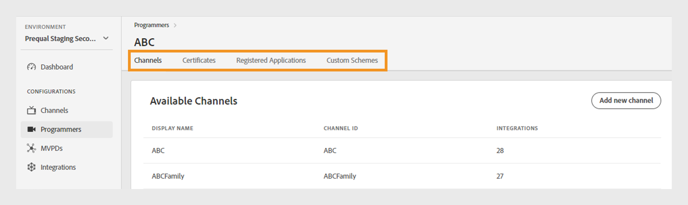

# Programadores {#programmers}

>[!NOTE]
>
>O conteúdo desta página é fornecido apenas para fins informativos. O uso dessa API exige uma licença atual do Adobe. Não é permitida nenhuma utilização não autorizada.

A variável **Programadores** seção do Painel TVE permite exibir e gerenciar configurações para o [programadores](/help/authentication/glossary.md#programmer) vinculado aos direitos de sua conta. Também é possível [adicionar um novo programador](#add-new-programmer) de acordo com sua necessidade.

A variável **Programadores** no painel esquerdo exibe uma lista de programadores existentes com os seguintes detalhes:

* **ID do programador**: um identificador de empresa de mídia no sistema.
* **Canais**: o número de canais associados vinculados a um programador.

*Lista de programadores existentes*

Digite o nome do programador no campo **Pesquisar** barra acima da lista para saber mais sobre um programador.

## Gerenciar configurações do programador {#manage-programmer-conf}

Siga estas etapas para gerenciar várias configurações de um programador específico.

1. Selecione o **Programadores** no painel esquerdo.
1. Selecione um programador na lista.
1. Selecione uma das guias a seguir para exibir e editar as configurações correspondentes do programador selecionado:

   * [Canais](#channels)
   * [Certificados](#certificates)
   * [Aplicativos registrados](#registered-applications)
   * [Esquemas personalizados](#custom-schemes)

   

   *Configurações do programador*

>[!IMPORTANT]
>
> Exibir [Revisar e enviar alterações](/help/authentication/tve-dashboard-review-push-changes.md) para obter mais informações sobre como ativar as alterações de configuração.

### Canais {#channels}

Esta guia exibe uma lista de canais vinculados a um programador atual. Selecione um canal específico na lista para acessar informações detalhadas na [Canais](/help/authentication/tve-dashboard-channels.md) seção.

Para adicionar um novo canal para o programador selecionado, selecione **Adicionar novo canal** no canto superior direito de **Canais disponíveis** seção. Saiba mais [como adicionar um novo canal](/help/authentication/tve-dashboard-channels.md#add-new-channel).

*Adicionar um novo canal*

### Certificados {#certificates}

Esta guia exibe uma lista de [certificados disponíveis](#available-certificates) usado nos fluxos de criptografia de metadados do usuário. Ela exibe detalhes sobre cada certificado que inclui:

* O status (ativado ou não para **criptografia de metadados do usuário** uso ou não)
* Número de série
* Nome da organização emissora
* Nome da organização do assunto
* Data de emissão
* Data de expiração
* Um menu suspenso para criptografar metadados do usuário (Se você selecionar **Sim**, o certificado criptografará informações confidenciais do usuário, como valores de código postal).

#### Certificados disponíveis {#available-certificates}

Esses certificados servem como chaves privadas ou públicas e são usados para criptografia de metadados do usuário. Todos os canais associados à mesma empresa de mídia podem usar esses certificados.

Você pode fazer as seguintes alterações nos certificados disponíveis:

* [Adicionar novo certificado](#add-new-certificate)
* [Excluir certificado](#delete-certificate)

##### Adicionar novo certificado {#add-new-certificate}

Siga estas etapas para adicionar um novo certificado.

1. Selecionar **Adicionar novo certificado** no canto superior direito da **Certificados disponíveis** seção.

   

   *Adicionar um novo certificado*

1. Cole a chave pública do seu certificado no **Novo certificado** caixa de diálogo.
1. Selecionar **Adicionar certificado**.

   Uma nova alteração de configuração foi criada e está pronta para atualização do servidor. Para usar o novo certificado listado no **Certificados disponíveis** prossiga com a [revisar e enviar alterações](/help/authentication/tve-dashboard-review-push-changes.md) fluxo.

1. Localize o novo certificado na lista de **Certificados disponíveis**.

   >[!IMPORTANT]
   >
   > Verifique se seus sistemas estão atualizados e prontos para usar o novo certificado.

1. Selecionar **Sim** de **Usado para criptografar metadados de usuário** para ativar um novo certificado.

##### Excluir certificado {#delete-certificate}

Siga estas etapas para excluir um certificado.

1. Passe o mouse sobre o certificado que deseja excluir da lista de **Certificados disponíveis**.
1. Selecionar **Remover**.

   

   *Remover o certificado selecionado*

1. Selecionar **Excluir** no **Excluir certificado** caixa de diálogo.

Uma nova alteração de configuração foi criada e está pronta para atualização do servidor. O certificado será excluído do **Certificados disponíveis** seção somente depois de [revisar e enviar alterações](/help/authentication/tve-dashboard-review-push-changes.md).

### Aplicativos registrados {#registered-applications}

Esta guia fornece uma lista de registros de aplicativos. Exibir [Gerenciamento dinâmico de registros de clientes](/help/authentication/dynamic-client-registration-management.md), para obter mais informações.

### Esquemas personalizados {#custom-schemes}

Esta guia exibe uma lista de esquemas personalizados. Exibir [Registro de aplicativo iOS/tvOS](/help/authentication/iostvos-application-registration.md) e [Gerenciamento dinâmico de registros de clientes](/help/authentication/dynamic-client-registration-management.md), para obter mais informações.

## Adicionar novo programador {#add-new-programmer}

Siga estas etapas para adicionar uma nova entidade programadora.

1. Selecione o **Programadores** no painel esquerdo.
1. Selecionar **Adicionar novo programador** no canto superior direito da **Programadores** seção.

   

   *Adicionar um novo programador*

1. Digite o identificador da empresa de mídia em **ID do programador** no **Novo programador** caixa de diálogo.
1. Digite o nome de uma marca comercial que você deseja mostrar no console em **Nome de exibição**.
1. Selecionar **Adicionar programador**.

Uma nova alteração de configuração foi criada e está pronta para atualização do servidor. Para usar o novo programador listado no **Programadores** prossiga com a [revisar e enviar alterações](/help/authentication/tve-dashboard-review-push-changes.md) fluxo.

