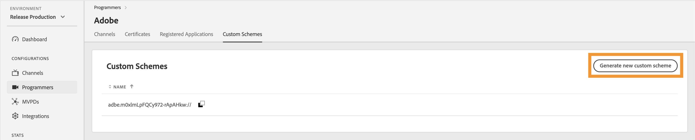

# Programadores {#programmers}

>[!NOTE]
>
>O conteúdo desta página é fornecido apenas para fins informativos. O uso dessa API exige uma licença atual do Adobe. Não é permitida nenhuma utilização não autorizada.

A seção **Programadores** do Painel do TVE permite exibir e gerenciar as configurações dos [programadores](/help/authentication/glossary.md#programmer) vinculados aos direitos da sua conta. Você também pode [adicionar um novo programador](#add-new-programmer) de acordo com sua necessidade.

A guia **Programadores** no painel esquerdo exibe uma lista de programadores existentes com os seguintes detalhes:

* **ID do Programador**: Um identificador de empresa de mídia no sistema.
* **Canais**: o número de canais associados vinculados a um programador.

*Lista de programadores existentes*

Digite o nome do programador na barra **Pesquisa** acima da lista para saber mais sobre um programador.

## Gerenciar configurações do programador {#manage-programmer-conf}

Siga estas etapas para gerenciar várias configurações de um programador específico.

1. Selecione a guia **Programadores** no painel esquerdo.
1. Selecione um programador na lista.
1. Selecione uma das guias a seguir para exibir e editar as configurações correspondentes do programador selecionado:

   * [Canais](#channels)
   * [Certificados](#certificates)
   * [Aplicativos registrados](#registered-applications)
   * [Esquemas personalizados](#custom-schemes)

   

   *Configurações do programador*

>[!IMPORTANT]
>
> Exiba [Revisar e enviar alterações](/help/authentication/tve-dashboard/new-tve-dashboard/tve-dashboard-review-push-changes.md) para obter mais informações sobre como ativar as alterações de configuração.

### Canais {#channels}

Esta guia exibe uma lista de canais vinculados a um programador atual. Selecione um canal específico na lista para acessar informações detalhadas na seção [Canais](/help/authentication/tve-dashboard/new-tve-dashboard/tve-dashboard-channels.md).

Para adicionar um novo canal para o programador selecionado, selecione **Adicionar novo canal** no canto superior direito da seção **Canais disponíveis**. Saiba [como adicionar um novo canal](/help/authentication/tve-dashboard/new-tve-dashboard/tve-dashboard-channels.md#add-new-channel).

*Adicionar um novo canal*

### Certificados {#certificates}

Esta guia exibe uma lista de [certificados disponíveis](#available-certificates) usados nos fluxos de criptografia de metadados do usuário. Ela exibe detalhes sobre cada certificado que inclui:

* O status (habilitado para uso de **criptografia de metadados do usuário** ou não)
* Número de série
* Nome da organização emissora
* Nome da organização do assunto
* Data de emissão
* Data de expiração
* Um menu suspenso para criptografar metadados do usuário (Se você selecionar **Sim**, o certificado criptografará informações confidenciais do usuário, como valores de código postal).

#### Certificados disponíveis {#available-certificates}

Esses certificados servem como chaves privadas ou públicas e são usados para criptografia de metadados do usuário. Todos os canais associados à mesma empresa de mídia podem usar esses certificados.

Você pode fazer as seguintes alterações nos certificados disponíveis:

* [Adicionar novo certificado](#add-new-certificate)
* [Excluir certificado](#delete-certificate)

##### Adicionar novo certificado {#add-new-certificate}

Siga estas etapas para adicionar um novo certificado.

1. Selecione **Adicionar novo certificado** no canto superior direito da seção **Certificados disponíveis**.

   

   *Adicionar um novo certificado*

1. Cole a chave pública do seu certificado na caixa de diálogo **Novo certificado**.

1. Selecione **Adicionar certificado**.

1. Localize o novo certificado na lista de **Certificados Disponíveis**.

   >[!IMPORTANT]
   >
   > Verifique se seus sistemas estão atualizados e prontos para usar o novo certificado.

1. Selecione **Sim** no menu suspenso **Usado para criptografar metadados de usuário** para ativar um novo certificado.

Uma nova alteração de configuração foi criada e está pronta para atualização do servidor. Para usar o novo certificado listado na seção **Certificados Disponíveis**, prossiga com o fluxo de [alterações de revisão e envio por push](/help/authentication/tve-dashboard/new-tve-dashboard/tve-dashboard-review-push-changes.md).

##### Excluir certificado {#delete-certificate}

Siga estas etapas para excluir um certificado.

1. Passe o mouse sobre o certificado que deseja excluir da lista de **Certificados disponíveis**.

1. Selecione **Remover**.

   

   *Remover o certificado selecionado*

1. Selecione **Excluir** na caixa de diálogo **Excluir certificado**.

Uma nova alteração de configuração foi criada e está pronta para atualização do servidor. O certificado será excluído da seção **Certificados disponíveis** somente após [revisar e enviar alterações](/help/authentication/tve-dashboard/new-tve-dashboard/tve-dashboard-review-push-changes.md).

### Aplicativos registrados {#registered-applications}

Esta guia exibe uma lista de aplicativos registrados. Para obter mais detalhes relacionados ao uso de aplicativos registrados, consulte a documentação da [visão geral do registro dinâmico de clientes](../../dcr-api/dynamic-client-registration-overview.md).

Você pode realizar as seguintes ações com aplicativos registrados:

* [Adicionar um novo aplicativo registrado](#add-registered-applications)
* [Baixar uma instrução de software](#download-software-statement)

#### Adicionar novo aplicativo registrado {#add-registered-applications}

Siga estas etapas para adicionar um novo aplicativo registrado.

1. Selecione **Adicionar novo aplicativo** no canto superior direito da seção **Aplicativos Registrados**.

   

   *Adicionar um novo aplicativo*

1. Selecione **Atribuído ao Canal** no menu suspenso da caixa de diálogo **Novo Aplicativo**.

   >[!IMPORTANT]
   >
   > É recomendável criar aplicativos registrados com permissões mais específicas e limitadas para melhorar a segurança e impedir o acesso não autorizado. Portanto, ao criar aplicativos registrados, considere usar opções mais restritas para o `channel` atribuído.

1. Selecione **Plataformas** no menu suspenso.

   >[!IMPORTANT]
   >
   > É recomendável criar aplicativos registrados com permissões mais específicas e limitadas para melhorar a segurança e impedir o acesso não autorizado. Portanto, ao criar aplicativos registrados, considere usar opções mais restritas para o `platforms` atribuído.

1. Selecione **Domínios** no menu suspenso.

   >[!IMPORTANT]
   >
   > No processo de registro do cliente, o aplicativo cliente pode solicitar permissão para usar um URL de redirecionamento para a finalização do fluxo de autenticação. Quando um aplicativo cliente usa uma URL de redirecionamento específica, ela é validada em relação à `domains` selecionada nesta seleção.

1. Digite o **Nome** do aplicativo.

1. Digite a **Versão** do aplicativo.

   >[!IMPORTANT]
   >
   > É recomendável criar um novo aplicativo registrado para cada atualização importante do aplicativo cliente para gerenciar o ciclo de vida e o uso. Se necessário, crie um tíquete por meio de nossa [Zendesk](https://adobeprimetime.zendesk.com) e peça ao seu Gerente técnico de conta (TAM) para revogar um aplicativo registrado para bloquear a funcionalidade de uma versão específica do aplicativo cliente.

1. Selecione o valor &quot;DIRETO&quot; de **Tipo** no menu suspenso.

1. Selecione **Adicionar aplicativo**.

Uma nova alteração de configuração foi criada e está pronta para atualização do servidor. Para usar o novo aplicativo registrado listado na seção **Aplicativos registrados**, prossiga com o fluxo de [alterações de revisão e push](/help/authentication/tve-dashboard/new-tve-dashboard/tve-dashboard-review-push-changes.md).

#### Baixar demonstrativo de software {#download-software-statement}

Siga estas etapas para baixar uma instrução de software.

1. Passe o cursor do mouse sobre o aplicativo registrado para baixar a instrução de software da lista de **Aplicativos Registrados**.

1. Selecione **Baixar**.

   

   *Baixar uma instrução de software*

### Esquemas personalizados {#custom-schemes}

Esta guia exibe uma lista de esquemas personalizados. Para obter mais detalhes relacionados ao uso de esquemas personalizados, consulte o [registro do aplicativo iOS/tvOS](/help/authentication/iostvos-application-registration.md).

Você pode fazer as seguintes alterações em esquemas personalizados:

* [Gerar um novo esquema personalizado](#generate-custom-schemes)

#### Gerar novo esquema personalizado {#generate-custom-schemes}

Siga estas etapas para gerar um novo esquema personalizado.

1. Selecione **Gerar novo esquema personalizado**.

   

   *Gerar um novo esquema personalizado*

Uma nova alteração de configuração foi criada e está pronta para atualização do servidor. Para usar o novo esquema personalizado listado na seção **Esquemas Personalizados**, prossiga com o fluxo de [alterações de revisão e envio por push](/help/authentication/tve-dashboard/new-tve-dashboard/tve-dashboard-review-push-changes.md).

## Adicionar novo programador {#add-new-programmer}

Siga estas etapas para adicionar uma nova entidade programadora.

1. Selecione a guia **Programadores** no painel esquerdo.

1. Selecione **Adicionar novo programador** no canto superior direito da seção **Programadores**.

   

   *Adicionar um novo programador*

1. Digite o identificador da empresa de mídia em **ID do Programador** na caixa de diálogo **Novo programador**.

1. Digite o nome de uma marca comercial que você deseja mostrar no console em **Nome de exibição**.

1. Selecione **Adicionar programador**.

Uma nova alteração de configuração foi criada e está pronta para atualização do servidor. Para usar o novo programador listado na seção **Programadores**, prossiga com o fluxo de [alterações de revisão e envio por push](/help/authentication/tve-dashboard/new-tve-dashboard/tve-dashboard-review-push-changes.md).
