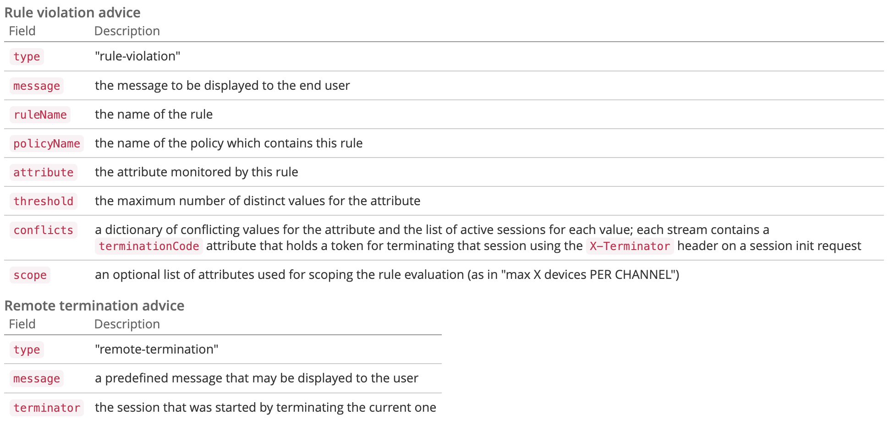

# Visão geral da API {#api-overview}

Exiba a [documentação da API online](https://streams-stage.adobeprimetime.com/swagger-ui/index.html) para obter mais detalhes.

## Finalidade e pré-requisitos {#purpose-prerequisites}

Este documento ajuda os desenvolvedores de aplicativos a usar nossa especificação da API do Swagger ao implementar uma integração com o Monitoramento de simultaneidade. É altamente recomendável que o leitor tenha uma compreensão anterior dos conceitos definidos pelo serviço antes de seguir essa diretriz. Para ter essa compreensão, é necessário ter uma visão geral da [documentação do produto](../cm-home.md) e da [especificação da API do Swagger](https://streams-stage.adobeprimetime.com/swagger-ui/index.html).

## Introdução {#api-overview-intro}

Durante o processo de desenvolvimento, a documentação pública do Swagger representa a diretriz de referência para entender e testar os fluxos da API. Este é um ótimo local para começar, a fim de ter uma abordagem prática e se familiarizar com a forma como os aplicativos reais se comportariam em diferentes cenários de interação do usuário.

Envie um tíquete no [Zendesk](mailto:tve-support@adobe.com) para registrar sua empresa e aplicativos no Monitoramento de Simultaneidade. O Adobe atribuirá uma ID de aplicativo a cada entidade. Neste guia, usaremos dois aplicativos de referência com IDs **demo-app** e **demo-app-2** que estarão sob o locatário do Adobe.

### Primeira aplicação {#first-app-use-cases}

O aplicativo com a ID **demo-app** foi atribuído pela equipe da Adobe a uma política com uma regra que restringe o número de fluxos simultâneos a 3. Uma política é atribuída a um aplicativo específico com base na solicitação enviada no Zendesk.

#### Recuperando metadados {#retrieve-metadata-use-case}

A primeira chamada que fazemos é para o recurso Metadados para obter a lista de atributos de metadados que precisam ser passados como dados de formulário durante a inicialização da sessão. Esses metadados serão usados para avaliar as políticas atribuídas para este aplicativo.

```http
# Request
user = 'demo-app'
pass = ''
curl -i -u ${user}:%{pass} http://streams-stage.adobeprimetime.com/v2/metadata

# Response Code
200
# Response Body
[]
```

Como podemos ver no campo de corpo da resposta, a lista de atributos de metadados está vazia. Isso significa que os atributos exigidos pelo design são suficientes para avaliar a política de três fluxos atribuída a esse aplicativo. Consulte também a [documentação dos Campos de metadados padrão](../technical/standard-metadata-attributes.md). Após esta chamada, podemos continuar e criar uma nova sessão no recurso Sessões REST.

#### Inicialização da sessão {#session-initial}

A chamada de inicialização de sessão é feita por um aplicativo após obter todas as informações necessárias para executá-la.

```http
# Request
user = 'demo-app'
pass = ''
curl -i -X POST -u ${user}:%{pass} http://streams-stage.adobeprimetime.com/v2/sessions/adobe/12345
```


Não há necessidade de fornecer um código de encerramento na primeira chamada porque não temos outros fluxos ativos. E nenhum atributo de metadados porque nenhum foi retornado da chamada Recuperando metadados.

Os parâmetros **subject** e **idp** são obrigatórios, eles serão especificados como variáveis de caminho de URI. Você pode obter os parâmetros **subject** e **idp** fazendo uma chamada para os campos de metadados **mvpd** e **upstreamUserID** da Autenticação Adobe Pass. Consulte também a [visão geral das APIs de metadados](https://experienceleague.adobe.com/docs/primetime/authentication/auth-features/user-metadat/user-metadata-feature.html?lang=pt-BR#). Neste exemplo, forneceremos o valor &quot;12345&quot; como o assunto e &quot;adobe&quot; como o idp.

```
# Response Code
  202
# Response Body
  no content
# Response Headers
  {
    "cache-control": "no-store",
    "content-length": "0",
    "date": "Tue, 01 Jan 2022 12:00:00 GMT",
    "expires": "Tue, 01 Jan 2022 12:01:00 GMT",
    "location": "76378b50-4eb0-43b4-b144-51cb62d85563", 
    "content-type": null
  }
```

Todos os dados que precisamos estão contidos nos cabeçalhos de resposta. O cabeçalho **Local** representa a ID da nova sessão criada e os cabeçalhos **Data** e **Expira** representam os valores usados para agendar o aplicativo para fazer a próxima pulsação para manter a sessão ativa.

Com cada chamada, você pode enviar os metadados necessários, não apenas os metadados obrigatórios do aplicativo. O envio de metadados pode ser realizado de duas maneiras:
* usando **consulta** **parâmetros**:

  ```sh
  curl -i -XPOST -u "user:pass" "https://streams-stage.adobeprimetime.com/v2/sessions/some_idp/some_user?metadata1=value1&metadata2=value2"
  ```

* usando **solicitação** **corpo**:

  ```sh
  curl -i -XPOST -u "user:pass" https://streams-stage.adobeprimetime.com/v2/sessions/some_idp/some_user -d "metadata1=value1" -d "metadata2=value2" -H "Content-Type=application/x-www-form-urlencoded"
  ```

#### Heartbeat {#heartbeat}

Faça uma chamada de heartbeat. Forneça a **id de sessão** obtida na chamada de inicialização de sessão, juntamente com os parâmetros **subject** e **idp** usados.

```http
# Request
user = 'demo-app'
pass = ''
curl -i -X POST -u ${user}:%{pass} http://streams-stage.adobeprimetime.com/v2/sessions/adobe/12345/76378b50-4eb0-43b4-b144-51cb62d85563
```

Na chamada de heartbeat, você pode enviar metadados da mesma maneira que faz na inicialização da sessão. É possível adicionar novos metadados a qualquer momento e atualizar valores enviados anteriormente com algumas **exceções**. Os seguintes valores, uma vez definidos, não podem ser alterados: **pacote**, **canal**, **plataforma**, **assetId**, **idp**, **mvpd**, **hba_status**, **hba**,
**mobileDevice**

Se a sessão ainda for válida (não expirou ou foi excluída manualmente), você receberá um resultado bem-sucedido:

```
# Response Code
  202
# Response Body
  no content
# Response Headers
  {
    "cache-control": "no-store",
    "content-length": "0",
    "date": "Tue, 01 Jan 2022 12:00:00 GMT",
    "expires": "Tue, 01 Jan 2022 12:01:00 GMT",
    "content-type": null
  }
```

Como no primeiro caso, usaremos os cabeçalhos **Data** e **Expira** para agendar outra pulsação para esta sessão específica. Se a sessão não for mais válida, essa chamada falhará com um código de Status HTTP 410 GONE.

Você pode usar a opção &quot;Manter o fluxo ativo&quot; disponível na interface do Swagger para executar pulsações automáticas em uma sessão específica. Isso pode ajudá-lo a testar uma regra sem precisar se preocupar com a placa intermediária necessária para fazer pulsações de sessão em tempo hábil. Esse botão é colocado junto com o botão &quot;Experimente&quot; na guia Swagger Heartbeat. Para definir uma pulsação automática para todas as sessões criadas, é necessário programá-las em uma interface separada do Swagger aberta em uma guia do navegador da Web.


#### Término da sessão {#session-termination}

O caso comercial de sua empresa pode exigir o Monitoramento de simultaneidade para encerrar uma sessão específica quando, por exemplo, um usuário para de assistir a um vídeo. Isso pode ser feito fazendo uma chamada DELETE no recurso Sessões.


```http
# Request
user = 'demo-app'
pass = ''
curl -i -X DELETE -u ${user}:%{pass} http://streams-stage.adobeprimetime.com/v2/sessions/adobe/12345/76378b50-4eb0-43b4-b144-51cb62d85563
```

Use os mesmos parâmetros para a chamada e para a pulsação da sessão. Os códigos de status HTTP de resposta são:

* 202 ACEITO para uma resposta bem-sucedida
* 410 DESAPARECEU se a sessão já tivesse sido interrompida.

#### Obter todos os fluxos em execução {#get-all-running-streams}

Esse endpoint oferece todas as sessões em execução para um locatário específico em todos os seus aplicativos. Usar os parâmetros **subject** e **idp** para a chamada:

```http
# Request
user = 'demo-app'
pass = ''
curl -i -X GET -u ${user}:%{pass} http://streams-stage.adobeprimetime.com/v2/runningStreams/{idp}/{user}
```

Ao fazer a chamada, você receberá a seguinte resposta:

```http
# Response Code
  200 
# Response Body
  {
    "runningStreams": [
      {
        "sessionId": "76378b50-4eb0-43b4-b144-51cb62d85563",
        "startTime": 1738760521421,
        "applicationId": "demo-app",
        "applicationName": "Demo application",
        "terminationCode": "94c8f7d9",
        "metadata": {
          "package": "premium"  
        },
      }
    ]
  }
# Response Headers
  {
    "cache-control": "no-store",
    "content-type": "application/json;charset=utf-8",
    "date": "Tue, 01 Jan 2022 12:00:00 GMT",
    "expires": "Tue, 01 Jan 2022 12:01:00 GMT",
  }
```

Para cada sessão, será obtido o **terminarcode** e os metadados serão concluídos.

Observe que o cabeçalho **Expira**. Esse é o momento em que a primeira sessão deve expirar, a menos que um heartbeat seja enviado.
O campo de metadados será preenchido com todos os metadados enviados quando a sessão for iniciada. Não o filtramos; você receberá tudo o que enviou.
A resposta inclui todos os fluxos em execução nos aplicativos de outros locatários, desde que os aplicativos estejam compartilhando a mesma política.
Se não houver sessões em execução para um usuário específico ao fazer a chamada, você receberá esta resposta:

```http
# Response Code
  200 
# Response Body
  {
    "runningStreams": [],
    "otherStreams": 0
  }
# Response Headers
  {
    "cache-control": "no-store",
    "content-type": "application/json;charset=utf-8",
    "date": "Tue, 01 Jan 2022 12:00:00 GMT",
  }
```

Observe também que, nesse caso, o cabeçalho **Expires** não está presente.

Caso uma sessão tenha sido criada matando outra, usando o cabeçalho **X-Terminate**, nos metadados, você encontrará o campo **substituído**. Seu valor é um indicador da sessão eliminada para liberar espaço para a atual.

```http
# Response Code
  200 
# Response Body
  {
    "runningStreams": [
      {
        "sessionId": "76378b50-4eb0-43b4-b144-51cb62d85563",
        "startTime": 1738760521421,
        "applicationId": "demo-app",
        "applicationName": "Demo application",
        "terminationCode": "c424312e",
        "metadata": {
          "superseded": "ab1a9d54",
          "package": "premium"  
        },
      }
    ]
  }
# Response Headers
  {
    "cache-control": "no-store",
    "content-type": "application/json;charset=utf-8",
    "date": "Tue, 01 Jan 2022 12:00:00 GMT",
    "expires": "Tue, 01 Jan 2022 12:01:00 GMT",
  }
```

#### Quebrando a política {#breaking-policy-app-first}

Para simular o comportamento do aplicativo quando a política de três fluxos atribuída a ele é quebrada, precisamos fazer três chamadas para a inicialização da sessão. Para que a política entre em vigor, as chamadas precisam ser feitas antes que uma da sessão expire devido à falta de heartbeats. Veremos que todas essas chamadas foram bem-sucedidas, mas se fizermos uma quarta, ela falhará com o seguinte erro:

```http
# Response Code
409 
# Response Body
  {
    "associatedAdvice": [
      {
        "type": "rule-violation",
        "message": "Number of active streams exceeded",
        "policyName": "demo-policy",
        "threshold": 4,
        "ruleName": "3 streams cap",
        "conflicts": {
          "76378b50-4eb0-43b4-b144-51cb62d85563" : [
            { 
              "terminationCode": "51fd351f", 
              "metadata": {
                "package": "premium",
                "show": "Friends" 
              },
              "channel": "Unknown",
              "startedAt": "2024-11-25T09:06:12.951Z",
              "deviceName": "Unknown",
              "applicationName": "Demo application"
            }
          ]
        }
      }
    ]
  }
```

Recebemos uma resposta 409 CONFLICT junto com um objeto de resultado de avaliação na carga. Isso indica que as políticas do lado do servidor não permitem que essa sessão seja criada ou continue. O corpo da resposta conterá um objeto EvaluationResult com um AssociatedAdvice não vazio, que é a lista de objetos Advice contendo explicações para cada violação de regra.

O aplicativo deve avisar o usuário sobre as mensagens de erro transportadas por cada instância Advice. Além disso, cada dica também indica os detalhes da regra, como atributo, limite, nome da regra e da política. Além disso, os valores conflitantes também serão incluídos na lista de sessões ativas para cada valor.

Essas informações são destinadas à formatação avançada de mensagens de erro e para permitir que o usuário tome medidas em relação às sessões conflitantes.

Cada sessão conflitante terá um **termincode** que pode ser usado para **matar** esse fluxo. Dessa forma, o aplicativo pode permitir que o usuário escolha quais sessões encerrarão para tentar obter acesso à sessão atual.

O aplicativo pode usar as informações do resultado da avaliação para exibir uma determinada mensagem ao usuário ao interromper o vídeo e tomar outras ações, se necessário. Um caso de uso pode ser o de interromper outros fluxos existentes para iniciar um novo. Isso é feito usando o valor **finishCode** presente no campo **conflicts** para um atributo conflitante específico. O valor será fornecido como o cabeçalho HTTP X-Terminate na chamada para uma nova inicialização de sessão.


Ao fornecer um ou mais códigos de encerramento na inicialização da sessão, a chamada será bem-sucedida e uma nova sessão será gerada. Em seguida, se tentarmos fazer um heartbeat com uma das sessões que foram remotamente interrompidas, obteremos uma resposta 410 GONE com uma carga de resultado da avaliação que descreve o fato de que a sessão foi encerrada remotamente, como no exemplo:


```http
# Response Code
  410 
# Response Body
  {
    "associatedAdvice": [
      {
        "type": "remote-termination",
        "message": "This session was terminated by a remote user",
        "terminator": {
          "channel": "Unknown",
          "startedAt": "2024-11-25T09:06:12.951Z",
          "deviceName": "Unknown",
          "applicationName": "Demo application"
        }     
      }
    ],
    "obligations": []
  }
```

O 410 pode ser retornado com ou sem um corpo, com base no que causou o encerramento da sessão atual.

Quando a resposta não tem corpo, 410 significa que uma chamada de heartbeat (ou encerramento) é tentada para uma sessão que não está mais ativa (devido ao tempo limite, a um conflito anterior ou a qualquer outra situação). A única maneira de se recuperar desse estado é o aplicativo iniciar uma nova sessão. Como não há corpo, o aplicativo deve lidar com esse erro sem que o usuário saiba.

Por outro lado, quando um corpo de resposta é fornecido, o aplicativo precisa procurar no atributo **associatedAdvice** para encontrar uma dica de **remote-termination** que indique a sessão remota iniciada com uma intenção explícita de **matar** a atual. Isso deve resultar em uma mensagem de erro como &quot;Sua sessão foi desativada pelo dispositivo/aplicativo&quot;.


### Corpo da resposta {#response-body}

Para todas as chamadas de API do ciclo de vida da sessão, o corpo da resposta (quando presente) será um objeto JSON que contém os seguintes campos:


**Conselho**
O **EvaluationResult** incluirá uma matriz de objetos Advice em **associatedAdvice**. Os conselhos são destinados ao aplicativo para exibir uma mensagem de erro abrangente para o usuário e (possivelmente) permitir que o usuário tome uma ação.

Atualmente, há dois tipos de avisos (especificados por seu valor de atributo **tipo**): **violação de regras** e **terminação remota**. O primeiro fornece detalhes sobre uma regra que foi quebrada e as sessões que estão em conflito com a atual (incluindo o atributo terminate que pode ser usado para encerrar essa sessão remotamente). A segunda é apenas declarar que a sessão atual foi deliberadamente encerrada por um remoto, para que os usuários saibam quem os expulsou quando os limites foram atingidos. Caso **substituído** esteja incluído nos metadados, a sessão em questão foi criada usando o cabeçalho **X-Terminate**.



**Obrigação**
A avaliação também pode conter uma ou mais ações predefinidas que devem ser acionadas pelo aplicativo como resultado dessa avaliação.


### Segunda aplicação {#second-application}

O outro aplicativo de exemplo que usaremos é o com id **demo-app-2**. A este foi atribuída uma política com uma regra que limita o número de fluxos disponíveis para um canal a no máximo 2.   Você deve fornecer a variável de canal para avaliar essa política.

#### Recuperando metadados {#retrieving-metadata}

Defina a nova ID do aplicativo no canto superior direito da página e faça uma chamada para o recurso Metadados. Você receberá a seguinte resposta:


```http
# Request
user = 'demo-app-2'
pass = ''
curl -i -u ${user}:%{pass} http://streams-stage.adobeprimetime.com/v2/metadata

# Response Code
200
# Response Body
[
  "channel"
]
```

Dessa vez, o corpo da resposta não é mais uma lista vazia, como no exemplo da primeira aplicação. Agora, o Serviço de Monitoramento de Simultaneidade declara no corpo da resposta que os metadados de **canal** são necessários na inicialização da sessão para avaliar a política.

Se você fizer uma chamada sem fornecer um valor para o parâmetro **canal**, obterá:

* Código de resposta - 400 BAD REQUEST
* Corpo da Resposta - uma carga do resultado da avaliação que descreve no campo **obrigações** o que é esperado na solicitação para inicialização da sessão para que a operação seja bem-sucedida.


```http
# Response Code
  400 Bad Request
# Response Body
  {
    "associatedAdvice": [],
    "obligations": {
      "namespace": "adobe.primetime.cm",
      "action": "refresh",
      "arguments": [
        "metadata"
      ]   
    }
  }
```

#### Inicialização da sessão {#session-init}

Atribua um valor para a chave de metadados necessária e defina-o como um parâmetro de formulário na solicitação de inicialização de sessão, conforme mostrado abaixo:

```http
# Request
user = 'demo-app-2'
pass = ''
curl -i -X POST -u ${user}:%{pass} http://streams-stage.adobeprimetime.com/v2/sessions/adobe/12345?channel=channel-1
```

Agora, a chamada será bem-sucedida e uma nova sessão será gerada.

#### Quebrando a política {#breaking-policy-second-app}

Para romper a regra que temos na política atribuída a este aplicativo, precisamos fazer duas chamadas com o mesmo valor de canal. Como no primeiro exemplo, a segunda chamada precisa ser feita enquanto a primeira sessão gerada ainda é válida.


```http
# Response Code
  409 
# Response Body
  {
    "associatedAdvice": [
      {
        "type": "rule-violation",
        "message": "Number of streams per channel exceeded",
        "policyName": "Adobe/demo-policy-2",
        "ruleName": "2 per channel",
        "conflicts": {
          "76378b50-4eb0-43b4-b144-51cb62d85563" : [
            { 
              "terminationCode": "51fd351f", 
              "channel": "Unknown",
              "startedAt": "2024-11-25T09:06:12.951Z",
              "deviceName": "Unknown",
              "applicationName": "Demo application"
            }
          ]
        }
      }
    ]
  }
```

Se utilizarmos valores diferentes para os metadados do canal sempre que criarmos uma nova sessão, todas as chamadas serão bem-sucedidas, pois o limite 2 tem escopo para cada valor individualmente.

Como no primeiro exemplo, podemos usar o código de terminação para interromper remotamente fluxos conflitantes ou podemos esperar que um dos fluxos expire, supondo que nenhum heartbeat será operado neles.
