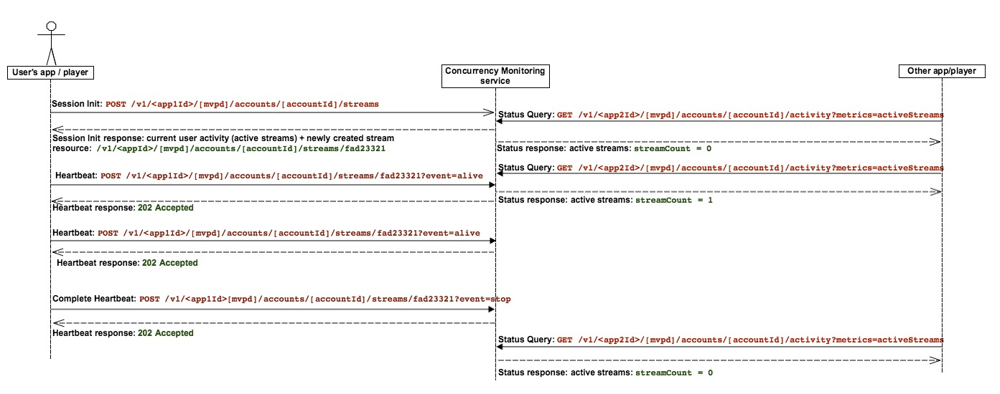

# Ponto de Informações de Política {#pip}

>[!NOTE]
>
>Esta página está obsoleta, pois se aplica à versão anterior da API do que não é mais recomendada para novas integrações

O diagrama a seguir mostra o fluxo caso o cliente opte pelo **Ponto de Informações de Política**, caso em que o CM é usado apenas para consultar a atividade e toda a lógica de acesso é incorporada ao aplicativo do cliente):

O diagrama abaixo ilustra como a contagem de fluxo funciona para um usuário que observa o conteúdo de dois dispositivos.

Em poucas palavras, o fluxo de mensagens normal é o seguinte:

1. Inicialmente, para um usuário que nunca usou o serviço, uma página da Web é carregada / um aplicativo é aberto, onde um aplicativo instrumentado do Serviço de monitoramento de simultaneidade faz uma chamada de Inicialização de sessão.
1. O Serviço de monitoramento de simultaneidade retorna o novo recurso de fluxo para pulsações, bem como a atividade atual do usuário.
1. Durante a reprodução do vídeo, o aplicativo instrumentado faz chamadas de heartbeat para o Serviço de monitoramento de simultaneidade, mostrando que o usuário está consumindo um vídeo no momento.
1. Em qualquer outro ponto, outras aplicações instrumentadas podem fazer chamadas de consulta de Status para o Serviço de Monitoramento de Simultaneidade, que retornará a atividade atual do usuário.
1. No fim da reprodução do vídeo, o aplicativo instrumentado pode fazer uma chamada de heartbeat com &quot;event=stop&quot;, significando que o vídeo parou e que o fluxo atual não deve mais ser contado como um fluxo ativo.
